## 空间自相关分析
&emsp;&emsp;传染病在空间上的传播扩散与人口分布、环境及其他各类空间因子息息相关,感染者之间非完全独立, 有一定的空间依赖性, 因而经典的相关性分析方法并不适用于传染病空间特征的分析，因此运用空间相关性分析来分析新型冠状病毒传播的空间关联关系, 即对象与邻近对象之间的共变特征。

---

### 1、全局空间自相关

&emsp;&emsp;全局空间自相关是从宏观的角度研究观测值在空间上的分布特征。本文运用全局 Moran’s I 来分析深圳市新型冠状病毒感染人群的空间自相关性。

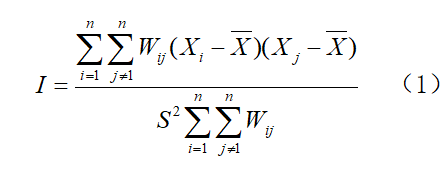

&emsp;&emsp;上式中，$I$为全局Moran指数，$n$为行政区个数;$X_i$、$X_j$为区域$i$、$j$的累计确诊人数。 $W_ij$为空间权重矩阵，用来度量空间单元之间的邻近关系，两地相邻为1，不相邻为0。$S^2$为累计确诊人数观测值的方差， $\overline{x}$为累计确诊人数的平均值。

&emsp;&emsp;全局 Moran’s I指数反映观测值在空间近邻时相似程度的大小，取值范围为[-1,1]，绝对值越大表示相关性越强。当指数为正值时，相邻地区间的观测值相似，空间正相关；当指数为负值时，为空间负相关；当指数取0时，相邻地区无空间相关性，空间上呈随机分布。

### 2、局部空间自相关

&emsp;&emsp;Moran’ I 指数只能从整体上对空间相关性进行平均度量, 它无法反映空间异质情况时 各个分区的空间聚类情况。因此运用LISA指数进行局部自相关分析，揭示区域变量的局部异常聚集状况与局部不稳定性特征。

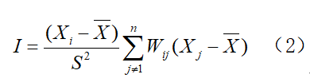

&emsp;&emsp;式中各元素含义与（1）式同。LISA集聚图能够定量反映出空间上的 4 种聚类特征: 

① 高值聚集 (高-高)-高风险值的空间统计单元邻近的周围区仍然是高值，为空间正相关；

② 低值聚集(低-低)-低风险值的空间统计单元邻近的周围区域仍然是低值，为空间正相关；

③ 高低聚集(高低)-高风险值的空间统计单元邻近的周围区域是低值，为空间负相关；

④ 低高聚集(低-高)-低风险值的空间统计单元邻近的周围区域是高值，为空间负相关。

### 3、全局空间自相关

（1）整体态势

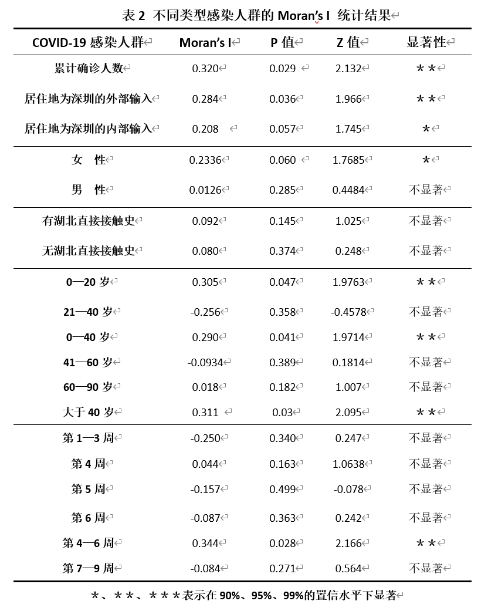

&emsp;&emsp;本文运用Geoda对深圳市感染人群各特征值的Moran’s I指数及其P值、Z值，检验其显著性。其中，累计确诊人数的 Moran’s I统计指数为0.320，零假设$H_0$: 累计确诊人数在空间上完全随机分布, 根据零假设进行999次Monte Carlo随机模拟得到Moran’s I的z-score为2.132,P<0.05,表明深圳市累计确诊人数在空间上显著正相关。居住地为深圳的外部输入和内部输入都是空间自相关，但是前者空间相关性高于后者。可能由于外部输入的患者是一代感染者，内部输入中有一部分人是受一代病例传染的二代感染者，因此其空间相关性相对较低。

(2)其他特征

&emsp;&emsp;由于性别、年龄、有无湖北直接接触史、发病时间都会对疫情空间传播模式产生影响， 因此本文对这些影响因子也进行全局空间自相关分析。

&emsp;&emsp;一、性别：女性患者的空间相关性高于男性，可能由于女性活动范围比男性小、活动空间更集中。

&emsp;&emsp;二、有无湖北直接接触史：有、无湖北直接接触史的人群都是空间正相关，前者相关性略高于后者，可能由于有湖北直接接触史的感染途径相对明确（多为湖北探亲、旅行、出差等），而无湖北直接接触史的感染途径相对随机和分散（原因不明确，如吃饭、逛街、看电影等）。

&emsp;&emsp;三、年龄：0-40岁和40岁以上的感染者均服从显著的空间正相关，后者相关性更高。可能是因为40岁以上感染者，年龄渐长，活动范围较小，空间上聚集性更高。

&emsp;&emsp;四、发病时间：新型冠状病毒传播的发病时间空间相关性经历了由弱到强再到弱的过程。

&emsp;&emsp;第1到3周（2019.12.29—2020.1.18）呈现空间负相关，且相关性弱；

&emsp;&emsp;第4到6周（2020.1.19—2020.2.8）呈现正相关，且在95%的置信水平下显著。

&emsp;&emsp;第7—9周（20202.9—2020.2.29）呈空间负相关，相关性变弱。

&emsp;&emsp;究其原因，可能是疫情早期，感染人数较少,新发病例受感染的途径较多，故疫情传播较为发散，自相关性不强；在流行高峰期，人群活动受到政府应急措施的限制，故这一时期的新发感染大多与医院和家庭传播有关空间聚集性较强；疫情流行晚期,，医院和家庭传播途径已得到有效控制，此时零星的新发病例大多感染途径不明，新冠肺炎在空间上又变得较分散。

### 4、局部空间自相关

&emsp;&emsp;全局空间自相关仅能整个研究区域累计确诊人数、性别、年龄等各指标自身的相似程度，但无法得知具体空间单元间的相似程度。因此我们运用LISA聚集图来分析新冠病毒在深圳市各区的空间分布模式及时空演化特征。LISA 集聚图中不同颜色代表不同的聚集类型，“热点地区”是显著高—高型聚集的地区，“冷点地区”是显著低—低型聚集的地区。

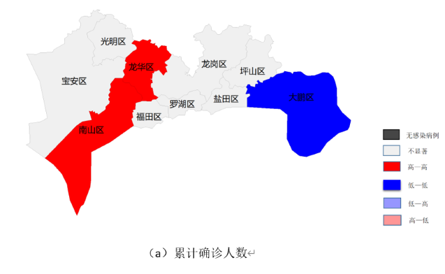

&emsp;&emsp;深圳市新型冠状病毒传播的高风险（热点区域）是西南方向的龙华区和南山区，低风险区域（冷点区域）是东部的大鹏区。其它区域传播风险呈随机分布。原因如下：深圳市西南区域是其发展程度高的中心区域，这个区域的人口密度高, 人们活动交流的频率大,疫情传播速度快，风险高。而东部区域则相反。因此应重点防控西南区域，分级防控其他区域。此外，外部输入病例和整体累计确诊人数的空间分布相同，内部输入病例的空间分布呈现低—高聚集的是龙华区，说明就内部输入而言，龙华区为累计确诊人数少，但与其相邻省份的累计确诊人数较多。

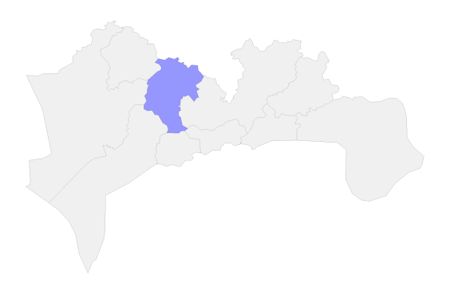

&emsp;&emsp;根据深圳市患者性别、有无湖北直接接触史、年龄、发病时间这4个因素，分析各市不同感染人群的空间分布特征。

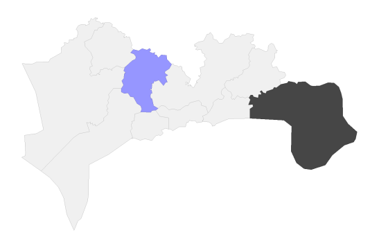

&emsp;&emsp;性别对新型冠状病毒的空间传播风险影响较小，其中男性累计确诊人数在空间呈随机分布，女性累计确诊人数的空间分布在龙华区呈现低—高聚集。

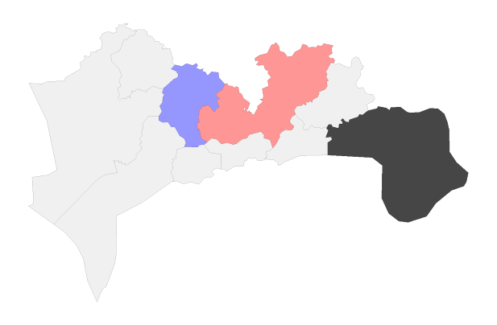

&emsp;&emsp;有湖北直接接触史的感染人群的空间分布中，龙华区呈现低—高聚集、龙岗区呈现高—低聚集，这说明龙岗区感染人数较龙华区多，且疫情传播风险也较高。无湖北接触史的感染人群在空间上呈现随机分布。

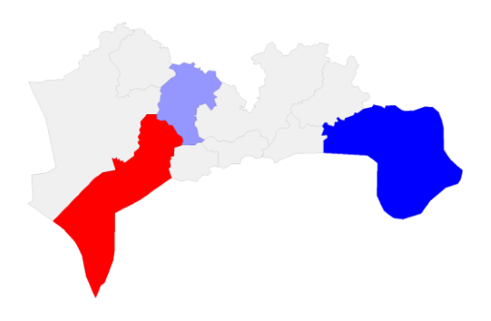

&emsp;&emsp;年龄在0—40岁和40岁以上的感染人群在空间上的冷点区域相同，均为大鹏区，但热点区域及低—高聚集区域存在差距。0-40岁感染人群空间分布的热点区域为中心城区—南山区，低—高聚集区域为龙华区；但40岁以上的感染人群的热点区域为南山区和龙华区。这表明，对于40岁以上的中老年人的防控比0—40岁的中青年的防控效果较差。

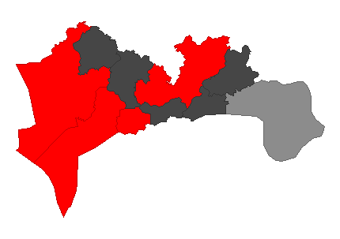

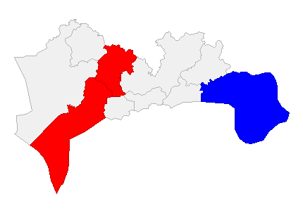

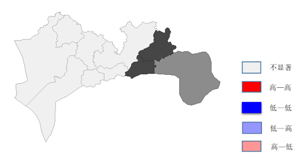

&emsp;&emsp;第1—3周的疫情传播空间分布中的热点区域为宝安区、光明区、福田区、龙岗区，这表明疫情早期传播是从经济发展迅速、人口流动频繁的西南地区开始的，且空间分布较发散。

&emsp;&emsp;第4—6周的空间分布和整体的累计确诊人数空间分布区域相同，这是因为在前期疫情爆发后，深圳市采取了管控措施，降低疫情在各区间的大面积传播概率，这一举措初见成效。

&emsp;&emsp;第7—9周时，疫情基本得到控制，空间分布不显著，仅有一些偶发的零星病例呈现随机分布状态。

&emsp;&emsp;总之，深圳市各区的新型冠状病毒的时空分布经历了由零星发散到大范围聚集再到零星发散的过程。
