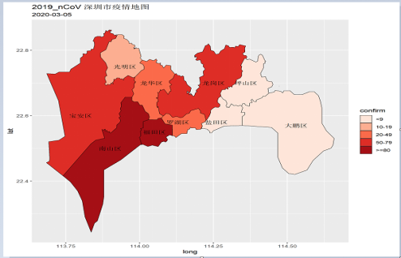
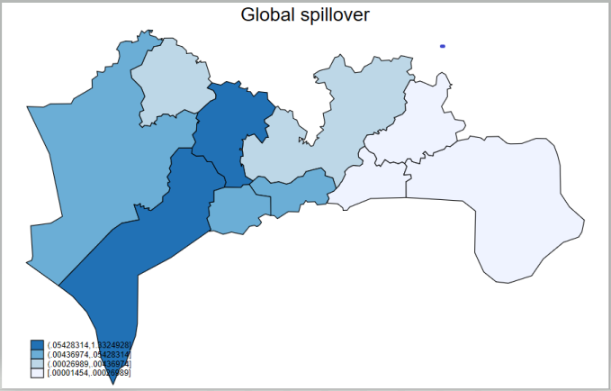
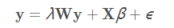
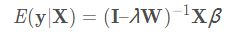
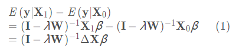
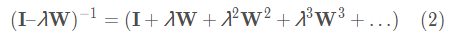
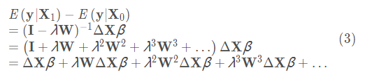
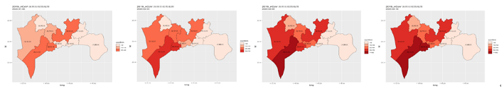
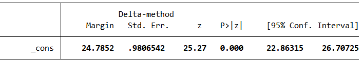
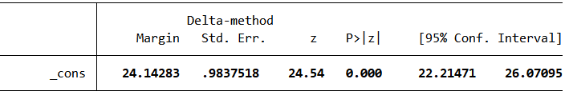

 
 
 
 

# 5.空间溢出效应

## 空间溢出效应概念
 
 
&emsp;&emsp;以人口密度这个自变量的变化为例，当某一个地区的人口密度发生变化时，不仅

会影响本地确诊人数的变化，也会影响与本地相邻地区的确诊人数。

&emsp;&emsp;也就是说，本地人口密度的变化会波及到附近的地区，这种影响就被称之为溢出

效应。

&emsp;&emsp;更进一步，与本地相邻的地区也会延续这一效应，再次对它们的周边区域产生影

响，这种连续的影响就叫做全局溢出效应。
            

## 空间溢出效应实例

&emsp;&emsp;选定一个具体地区以它为中心，观察其空间上的溢出效应。这里我们选择的是深

圳市南山区，因为深圳市疫情的首例发病患者出现在南山区，该地累计确诊人数也是处在

十个行政区的首位。并且南山区的生产总值，人口密度，区位功能综合得分这几个变量的

空间相关性均表现出高高聚集。所以我们以它为例进行说明，可以得到一个切合实际情况

的解释结果。

## 空间溢出效应实例
&emsp;&emsp;以深圳市南山区的人口密度变化为例:

&emsp;&emsp;如果南山区的人口密度由实际情况73.7(百人/平方公里)增加到100(百人/平方公里)

时,其它地区的确诊人数会如何变化?

 - 根据之前估计的模型，分下面三步解决这个问题。
 
 1. 基于原始的数据，通过估计出的模型预测各个区的确诊人数。
    
        在stata软件中使用**predict y0**实现
 
 2. 增加南山区的人口密度至100(百人/平方公里),再次预测各个行政区的确诊人数。
    
        在stata软件中使用**replace pd = 100 if cname == "南山区"**和**predict y1**实现
    
 3. 计算两次预测值的差值，将差值绘制在深圳市的地图上。
    
        在stata软件中使用**generate double y_diff = y1 - y0**、**grmap, activate**
    
        和**grmap y_diff, title("Global spillover")**实现
        

## 空间溢出效应图
&emsp;&emsp;由南山区人口密度变化产生的确诊人数溢出效应图：

 

## 空间溢出效应的逐步分解
&emsp;&emsp;SAR模型的矩阵形式是

&emsp;&emsp;求解y的值

&emsp;&emsp;给定X的值下y的平均值，被称为y在X的条件下的期望。因为ϵ独立于X，y在X下的条件期望是

&emsp;&emsp;由于y是一个向量，这个条件期望表示深圳市每个区确诊人数的平均值。

&emsp;&emsp;下面这个公式表示当X从一组值变化到另一组值后，y的变化效果。

&emsp;&emsp;将$X_0$中南山区的人口密度增加到100个单位时，其余数据均保持不变，
$d$对应的即为$X_1$。通过这种表示，我们可计算从$X_0$到$X_1$的改变所引起的深圳市每个
行政区平均确诊人数的变化。

## 空间溢出效应的逐步分解
&emsp;&emsp;其中，$ΔX=X_1–X_0$。
接下来，我们以 SAR 模型为基础，构造用于产生动图的表达式。逆矩阵可以用
等比数列展开公式写成指数大小逐渐减小的各项之和：

&emsp;&emsp;将公式 (2) 代入公式 (1)，得到

&emsp;&emsp;公式(3)就是生成动态图形效果的表达式。每一项都很直观，在案例中很容易解释：

&emsp;&emsp;第一项$ΔXβ$是初始效应变化，它只影响南山区本地的确诊人数。

&emsp;&emsp;第二项$λWΔXβ$是南山区确诊人数的变化对其邻居的影响。

&emsp;&emsp;第三项$λ^2 W^2ΔXβ$是南山区的变化对南山区邻居的邻居的影响。

&emsp;&emsp依次类推，可以得到其他变量的含义。

## 为溢出效应创建动态图形

&emsp;&emsp;上图从左到右显示了南山区人口密度（pd）由73.7增加到100(百人/平方公里)

时，对本地及周边确诊人数的连续动态溢出效应。

  第一个图仅显示第一项$ΔXβ$计算的变化。
  
  第二个图仅显示从第一项到第二项$ΔXβ+λWΔXβ$计算的变化。
  
  第三个图显示从第一项到第三项$ΔXβ+λWΔXβ+λ^2 W^2ΔXβ$计算的变化，以此类推。

&emsp;&emsp;可以看出这一效应在连续作用4期后遍布所有行政区，与“溢出中心”南山

区越邻近的行政区所受的间接影响程度越大。

## 空间溢出效应的逐步分解
&emsp;&emsp;上述研究选取的是2月3日各区累计确诊人数，此时疫情并未处于峰值，还有一定的

发展空间。将疫情首发地南山区的动态溢出效应图与疫情实际发展形式进行对比，

&emsp;&emsp;可看出南山区到各区的溢出效应与传染病的空间传播趋势基本吻合。

因此，对溢出效应进行逐期动态分解可以在一定程度上很好地解释疫情的空间蔓延趋势。

## 人口密度pd变动的政策分析:
&emsp;&emsp;假定每个行政区的人口密度都下降一个单位（百人/平方公里），使用stata软件对这一假定作分析，预测平均确诊人数的变动情况，平均确诊人数从24.78下降至24.14人。

&emsp;&emsp;人口密度存在显著的空间溢出效应，是由于深圳市经济发展迅速，西部是新兴产业聚集地，汇集大量工作群体，便利的交通网络也使得人口在各区之间的流动更加频繁，因此，某一地区人口密度变化可能将本地人口集聚活动陆续渗透到周边地区，人口密度增加就相当于增加了人与人接触的机会，感染风险也相应增加,进而间接影响了周围地区的确诊人数。所以，疫情期间严格控制人口流动，减少聚集性活动是防止疫情进一步恶化的有力措施。

 
 
 
 

# 6.结论与展望

## 6.1 深圳市疫情时空发展规律

&emsp;&emsp;疫情变化趋势可分为以下四个阶段：

&emsp;&emsp;（1）1月1日至10日为发病初期，首发地点位于南山区多为初代感染者，疫情在

1月20日至30日达到了爆发期。疫情有以南山区、福田区为中心随时间向周围行政

区扩散的趋势.

&emsp;&emsp;（2）1月30日后，感染人数增速放缓，深圳市疫情迎来第一个拐点。2月3日起深

圳市新增确诊人数逐日减少，前期的管控措施起到了很好效果，有效阻断疫情在人

群中的蔓延。疫情空间分布总体呈现东北—西南走向，主要集聚于西部各区。

&emsp;&emsp;（3）2月1日起新增出院人数逐日增加，2月17日，新增确诊与出院人数同步变化。

&emsp;&emsp;（4）自2月26日起，新增确诊人数逐渐趋于0，深圳市疫情已得到基本控制。 

## 6.2 深圳市疫情传染特征
&emsp;&emsp;（1）**年龄特征**：深圳市病例30-70岁人数最多，工作群体与老年人为易感人群。

&emsp;&emsp;（2）**感染源特征**：早期发病（1月1日至10日）的初代传染者多为湖北输入型。

&emsp;&emsp;（3）**集群式感染特征**：由于与湖北有直接接触的患者起初并不知晓此疾病的

存在，导致潜伏时期该地区与其接触的亲人、所生活社区的成员发生了大规模传染。

&emsp;&emsp;（4）**深圳市疫情重症患者的主要特征**： 年龄和发病时段是其主要因素，年龄

越大的早期发病者为重症患者的可能性较大。

## 6.3 深圳市确诊人数的空间溢出效应
&emsp;&emsp;通过建立空间自回归模型，发现深圳市疫情分布与各区经济发展状况、人口密度、

区位功能等社会经济因素具有高度的空间相关性，且确诊人数在相邻区域内存在空间

溢出效应。对动态溢出效应逐步分解可用于对疫情空间蔓延趋势进行预测，进而识别

溢出效应较高的地区，并对其进行重点防控。

## 6.4模型的改进与展望
&emsp;&emsp;（1）此次报告模型使用的空间权重矩阵是空间邻接矩阵，只考虑了地理因素，如果

研究的范围较广，比如涉及省际、国际地区之间的关联关系，还需要引入经济因素，

建立地理-经济嵌套矩阵，这种联系会更接近真实世界的情况。

&emsp;&emsp;（2）建立的空间自回归模型使用的仅仅是截面数据，希望之后能加入

时间因素建立空间面板模型，探究深圳市疫情的时空演变规律。

 
 
 
 

# Thank you!
