##
 

**演讲内容**

 

#### 1.研究背景及意义

 

#### 2.流行病学特征分析

 

#### 3.时间演变与染病特征分析

 

#### 4.空间集聚特征分析

 

#### 5.疫情分布的影响因素分析

 

#### 6.结论与建议

 
 
 
 

# 1.研究背景及意义
##
 
 

**1.1 研究背景**

- 纵观当下，COVID—19已蔓延到全球200个国家和地区，已成为一起严重的全球性突发公共卫生事件，早日抑制疫情发展、恢复社会活力是全球人民的共同愿望。

- 深圳市作为国际化城市，也是我国拥有口岸数量和出入境人员最多的城市，外来人员流动频繁。而疫情在人群与地域的传播扩散是典型时空演化与人地互动的地理过程，因此，运用空间计量分析方法，研究深圳市COVID-19时空演化特征及影响因素，对疫情现实防控有积极作用。

##
 
 

**1.2 文献综述**

-  胡碧松等（2010）利用空间分析与网络分析方法研究了北京市外部输入输出流的高风险时空热点以及网络结构，揭示了SARS流行过程中的潜在时空演化规律及个体与区域之间的传播特性，反映了疾病的传播特点。

- 张人杰等（2019）以浙江省2013—2016年感染H7N9禽流感病例以及病毒外环境监测数据为基础，运用地理加权回归模型（GWR）分析禽流感病例数与人口密度、家禽密度以及外环境病毒分布的关系。

- 关于COVID-19疫情的时空传播研究，徐小可等（2020）基于人口流动数据，对疫情暴发前期武汉市外流人口的去向进行分析，探寻了离汉人员对疫情传播的影响。

- 曹志冬重现了SARS（2010）在北京市流行的时空传播过程,得到了精确到街道办、乡和镇的SARS发病率图及SARS传播的空间模式与时空传播规律和驱动因素, 评价了疫情防控效果。

##
 
 

**1.2 文献综述**

- 金安楠（2020）等基于官方公布的确诊病例数据、人工判读采集的病例详情及城市内部POI数据等，运用文本分析、数理统计、空间分析等方法，解析深圳市COVID-19确诊病例的流行病学特征和疫情的时空演化过程，综合探索疫情防控对策。

- 刘郑倩等（2020）利用珠海市卫健局发布的98例新冠病毒病例流据,通过26个疫情聚集单元
的时空特征分析和4类典型传播路径的案例剖析，探讨了珠海市新冠肺炎聚集发生的时空规律和传播路径。

- 苏理云（2020）运用空间统计方法揭示了中国各省累计确诊人数的静态空间分布和动态演变规律。

- 卢丹丹等（2018）以肝吸虫为例，运用空间自相关分析、时空扫描、空间面板分析探讨吸虫病的空间分布特征及影响因素，为疫情防控提供科学依据。

##
 
 

**1.3 研究主题**

- 本文拟利用深圳市卫生健康局1月19日-4月13日公开的458例确诊病例数据、POI数据、地理信息数据等，运用空间自相关、核密度估计、时空扫描聚类分析、空间自回归模型等方法

- 全面探讨深圳市COVID-19流行病学特征、时间演化和染病特征

- 解析深圳市疫情传播的空间演化特征、空间关联特征、空间集聚特征，重现了COVID-19在深圳市流行的时空传播过程

- 基于空间自回归模型对深圳市常住人口变动和GDP变动做政策分析和空间溢出效应分析

- 为之后研究疫情预警机制提供基础，也为研究国内外疫情传播规律提供参考

##
 
 

**1.4 数据来源及处理**

 

**1.数据来源**

- （1月19日-4月13日）深圳市卫生健康局公开的458例确诊病例数据,包含患者的个人信息和感染信息等

- 深圳市地理信息数据来自于GADM，一个全球行政区划数据库，它拥有全球大部分国家和地区的行政区划界线数据[网址](http://www.gadm.org/country)

- 深圳市常住人口、GDP数据等源自《深圳统计年鉴2019》
- 深圳市疫情小区、每日人群聚集地、定点医院等POI数据是用python从百度地图爬取得来

##
 

**2.数据处理**

- 在数据整理中，我们发现深圳市官方发布的每日新增确诊病例个案详情表的统计口径前后不一致，具体表现为：
 
 
&emsp;&emsp;1月19日-1月30日为24小时发布制，即每日0时-24时为当日新增确诊病例。
 
&emsp;&emsp;1月31日-2月13日为12小时发布制，即前一日12时-当日12时为当日新增病例。
 
&emsp;&emsp;2月14日-4月13日为24小时发布制，即每日0时-24时为当日新增确诊病例。
    
- 考虑到疫情在1月末、2月初达到峰值，新增确诊个例的前后统计口径不一致会影响对深圳市疫情峰值、时间演化特征的判断，因此我们依据深圳市官方发布的深圳市“新冠肺炎”-每日确诊病例统计表，对每日新增确诊病例个案详情表进行如下调整。
  
- 1月31日-2月13日的新增病例中，将当日的0-12时的病例和之前归入后一日的12时-24时的病例都归入当日。如此调整，将所有病例数据都调整为24小时发布制，实现前后统计口径的统一。

 
 
 
 

# 2.流行病学分析
##
 

**2.1感染人群结构特征**

 - 深圳市市458名感染者中人数最多的年龄组为41—60岁，最少的为1—20岁。
 - 感染人群中女性占比略多于男性
 - 各年龄组患者中，有湖北接触史的人数明显高于无湖北接触史人数，且二者之比呈倍数关系
 - 后3组的有无湖北接触史之比呈递增态势，说明年长者接触湖北病例的可能性更高

##
 

**2.2感染人群分类特征**

&emsp;&emsp;按病例输入源和居住地可以将深圳市感染人群分为如下6类

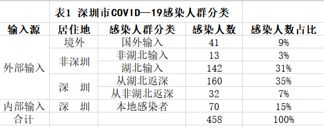

 - 感染者输入源看，深圳市感染人群以外部输入为主，共388例，占比为85%
 - 从感染者居住地看，居住地在深圳市的感染者有262例，占比57%
 - 其中从湖北输入和湖北返深的病例人数最多，占比66%
 
##
 

**2.3深圳市各区病例空间分布特征**

 - 居住地为深圳市的累计确诊人数分布呈现西高——东低态势，西部为重灾区，东部为“免疫区”
 - 福田区、南山区累计确诊人数最多；坪山区、大鹏区、盐田区累计确诊人数最少
 - 原因： 西部地区地势平缓、经济发达、人口密度大;东部地形多为山地、经济欠发达
 

 
 
 
 

# 3.时间演变与染病特征分析

##

**3.1 时间演变特征分析**

**1.整体时间演变特征**

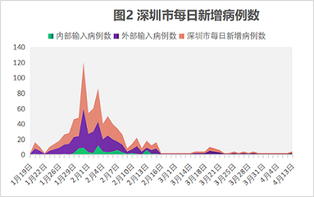

 - 深圳市的每日新增确诊人数呈阶段性变化特征
 - 1月19日—1月23日是初始偶发期（第一阶段）；1月24日—2月3日为快速增长期（第二阶段）；2月4日—2月15日为波动下降期（第三阶段）；2月16日—4月13日为平稳收缩期（第四阶段）
 - 其中3月1日之后的病例均为境外输入病例，在3月18日-21日病例数有小幅上升。
 - 外部输入病例增长和整体增长态势基本一致，每日新增数量多，波动大，在1月31日达到峰值；内部输入病例：日增量少，波动小。初步判断深圳市疫情的峰值是1月31日。

##

**2.不同感染人群的时间演变特征**

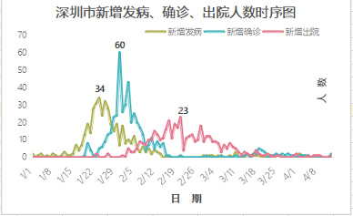

 - 新增发病人数1月1日已有市民发病，在1月24日达到峰值，共34例；之后发病人数开始下降。
 
 - 而1月24日开始，深圳市新增确诊人数进入快速增长期，且在1月31日达到峰值，共60例。
 
 - 由此可见在疫情的第一、第二阶段，从发病到确诊大概需要1周时间，患者在发病时未及时入院隔离。后两个阶段，由于疫情防控措施的执行和医护人员的确诊、治疗手段提升，从发病到确诊的间隔时间越来越短，疫情得到控制。

 - 新增出院人数第1月23日有2例患者出院。在2月21日达到峰值，共23例。可见从确诊到出院的间隔时间短，治疗速度快。

##
**3.不同感染人群的时间演变特征**

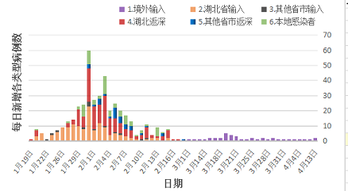

- 从外部输入角度看：第一类是在湖北感染的深圳市民,这类感染人群占比最高，多是在武汉探亲感染；返深后，进一步引发家庭聚集性传染。
- 第二类是非湖北地区感染的深圳市民,人数少、占比低。除2月3日、6日外，其他日期新增确诊人数均没超过5例。 
- 第三类是在深确诊的湖北市民，此类人群累计确诊人数达142例，仅次于第一类人群。
- 第四类是在深圳确诊的非湖北人员，他们多接触过湖北人员，日增确诊病例数最少。
- 从内部输入角度看：第五类是在深圳本地接触湖北人员的感染人群;第六类是无湖北人员接触史的本地感染人群。两类人群每日新增确诊病例都比较少，占比低。

---

**3.2 染病特征分析**

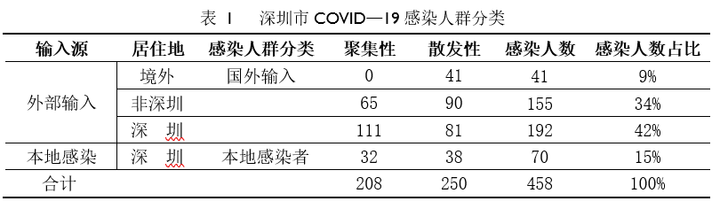

- 从病例来源来看，深圳市以输入性病例为主，达到388例，占比85%；
- 输入性病例包括三种类型，其中境外输入41例，占比9%，非深圳市民输入155例，占比34%，深圳市民返深192例，占比42%；本地感染者70例，占比15%。
- 从发病性质来看，聚集性病例208例，占比45.4%，散发性病例250例，占比54.6%。

##

**2.社会网络关系**

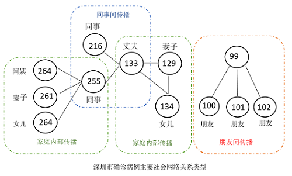

- 深圳市458例确诊病例中，208例之间存在家庭、朋友或同事等社会网络关系。
- 家庭关系的包含199例病例，占确诊病例43.4%；朋友关系的包含6例病例，同事关系的包含3例病例。此外，仍有250例确诊病例社会网络关系不明。
- 由此可见，深圳市确诊病例以散发性病例为主。在聚集性病例中，社会网络关系主要以家庭关系为主。
- 疫情爆发期间正值春节期间，返乡探亲、家人团聚等家庭活动增加了人员流动性和病毒在家庭内部的传播；朋友与同事之间发病案例极少，可见疫情期间小区封闭管理，企业停工停产等一系列措施有效阻断了病毒在朋友、同事之间的传播途径。

 
 
 
 

# 4.空间聚集特征

##

**4.1 空间关联特征**

- 我们运用空间相关性分析来分析新型冠状病毒传播的空间关联关系、即对象与临近对象之间的共变特征。

全局空间自相关

- 全局空间自相关是从宏观的角度研究观测值在空间上的分布特征。运用莫兰指数来分析深圳市新型冠状病毒感染人群的空间自相关性。

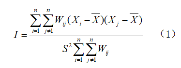

局部空间自相关

- 运用LISA指数进行局部自相关分析，揭示区域变量的局部异常聚集状况与局部不稳定性特征。

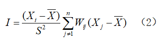

##

**4.1.1全局空间自相关分析**

 
 

 **1.整体态势**

- 本文运用Geoda对深圳市感染人群各特征值的Moran’sI指数及其P值、Z值，检验其显著性。其中，累计确诊人数的 Moran’s I统计指数为0.320，零假设：累计确诊人数在空间上完全随机分布

-根据零假设进行999次MonteCarlo随机模拟得到Moran’sI的z-score为2.132,P<0.05,表明深圳市累计确诊人数在空间上显著正相关。

- 居住地为深圳的外部输入和内部输入都是空间自相关，但是前者空间相关性高于后者。

##
 
 

 **2.其他特征**

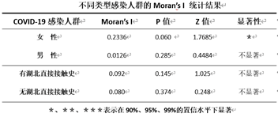

- 性别：女性患者的空间相关性高于男性。

- 有无湖北直接接触史：有、无湖北直接接触史的人群都是空间正相关，前者相关性略高于后者。

##
 
 

 **2.其他特征**

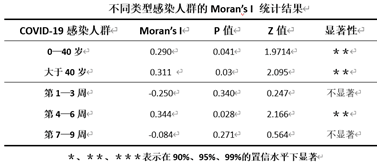

- 年龄：0-40岁和40岁以上的感染者均服从显著的空间正相关，后者相关性更高。
- 发病时间：新型冠状病毒传播的发病时间空间相关性经历了由弱到强再到弱的过程。

&emsp;&emsp;第1到3周呈现空间负相关，且相关性弱；第4到6周呈现正相关，且在95%的置信水平下显著。第7—9周呈空间负相关，相关性变弱。

##
 
 

**4.1.2局部空间自相关**

 

- 运用LISA聚集图来分析新冠病毒在深圳市各区的空间分布模式及时空演化特征。

- LISA集聚图中不同颜色代表不同的聚集类型，“热点地区”是显著高—高型聚集的地区，“冷点地区”是显著低—低型聚集的地区。

##

 **1.累计确诊人数**
 

- 深圳市新型冠状病毒传播的高风险（热点区域）是西南方向的龙华区和南山区，低风险区域（冷点区域）是东部的大鹏区。其它区域传播风险呈随机分布。

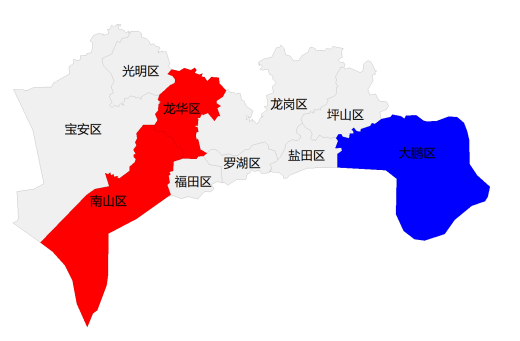

##
 
 

 **2.内部、外部输入病例**
 

- 外部输入病例和整体累计确诊人数的空间分布相同，内部输入病例的空间分布呈现低—高聚集的是龙华区，说明就内部输入而言，龙华区为累计确诊人数少，但与其相邻省份的累计确诊人数较多。

##
 
 

**3.不同性别确诊病例**
 
  
- 根据深圳市患者性别、有无湖北直接接触史、年龄、发病时间这4个因素，分析各市不同感染人群的空间分布特征。

- 性别对新型冠状病毒的空间传播风险影响较小，其中男性累计确诊人数在空间呈随机分布，女性累计确诊人数的空间分布在龙华区呈现低—高聚集。

##
 
 

**4.有无湖北直接接触史**

  

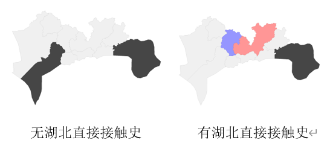

- 有湖北直接接触史的感染人群的空间分布中，龙华区呈现低—高聚集、龙岗区呈现高—低聚集，这说明龙岗区感染人数较龙华区多，且疫情传播风险也较高。无湖北接触史的感染人群在空间上呈现随机分布。

##
 
 

 **5.病例年龄**
 

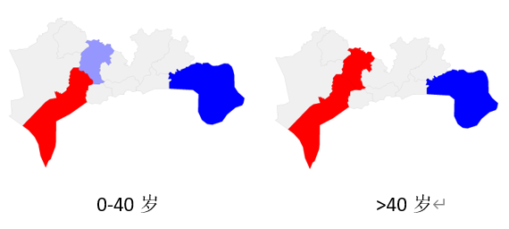

- 年龄在0—40岁和40岁以上的感染人群在空间上的冷点区域相同，均为大鹏区，0-40岁感染人群空间分布的热点区域为中心城区—南山区，低—高聚集区域为龙华区；但40岁以上的感染人群的热点区域为南山区和龙华区。

##

 **6.发病时间**
 

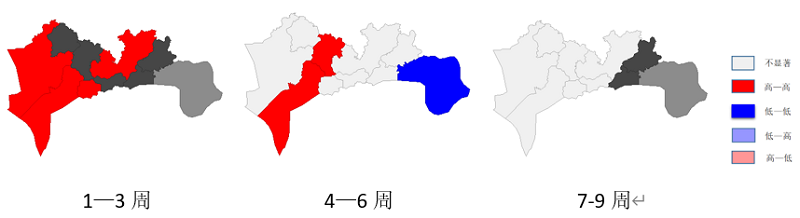

- 第1—3周的疫情传播空间分布中的热点区域为宝安区、光明区、福田区、龙岗区，
- 第4—6周的空间分布和整体的累计确诊人数空间分布区域相同。
- 第7—9周时，疫情基本得到控制，空间分布不显著，仅有一些偶发的零星病例呈现随机分布状态。
- 总之，深圳市各区的新型冠状病毒的时空分布经历了由零星发散到大范围聚集再到零星发散的过程。

##

**4.2 空间集聚特征**

**4.2.1核密度估计**

- 核密度估计（ＫＤＥ）方法认为区域内任意位置都有１个可测度的事件密度（也称强度），该位置的事件密度可以通过其周围单位面积区域内的事件点数量来估计。

- 此方法是空间分析中运用广泛的非参数估计方法，利用核函数计算要素在其邻域边缘的密度，可以得到研究对象连续、平滑的空间分布形态。

- 本文以核密度估计法来考察深圳市疫情小区的空间密度分布特征，这种方法可以很好地反映深圳市疫情小区分布的区域态势和局部差异。

- 具体计算公式为：
$$f_n(x)={\frac{1}{nh}}\sum_{i=1}^{n}k({\frac{x-X_i}{h}})$$
- 其中$n$等于疫情小区总数；$h>0$为带宽，即搜索半径；${x-X_i}$表示点到事件的距离,$k({\frac{x-X_i}{h}})$为核函数。

##

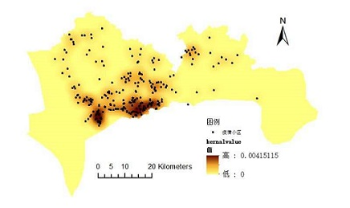

4-1 核密度分布图

- 由深圳市疫情小区核密度分布图可知，疫情小区在空间上总体呈现东北—西南走向，主要集聚于西南片区，在福田区和南山区南部形成“两核”。形成上述格局的原因包括：
- ① 城市形态因素：深圳市整体呈“东—西”走向的城市形态，西部宽阔，东部狭长。
- ② 住宅小区分布因素：西南片区邻近海岸线，地势平缓，建有连通香港与澳门的多个口岸，住宅小区集中分布于此。
- ③片区吸引力因素：福田区为深圳市行政、金融、文化、商贸和国际交往“五大中心”，南山区为深圳市科研、教育、体育中心，相互毗邻的二者是深圳市最具吸引力的片区。

---

**4.2.2时空扫描分析**

**1.理论**

- 时空扫描分析是一种热点区域识别方法，由Kulldorff于1998年提出，旨在探测一定时空范围内的聚集性,与随机分布模式比较是否显著增加，并确定聚集性最可能异常的时空事件集合。

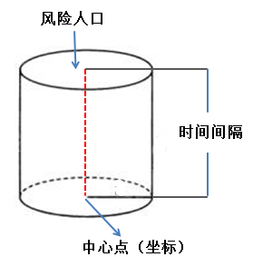

图4-2 时空扫描原理示意图

---

- 时空扫描基本思想：同时考虑时间和空间两个因素，主要采用移动窗口法(movingwindows)，如图所示，在地理空间上创建扫描窗口（圆柱体），圆柱体的底面对应研究的地理区域，圆柱体的高对应扫描时间间隔，圆柱体的半径对应扫描的风险人口。扫描窗口的大小和位置在地理空间上不断的变化，其过程为：随机选取地理空间上任一地理位置作为扫描窗口的底面中心，相应的地理区域（扫描窗口的底面积）不断变化，对应时间间隔（扫描窗口的高）也不断变化，直到达到预先规定的上限为止。窗口大小和位置的动态变化可以避免人为选定研究区域范围和圆心位置造成的偏倚。

- 对每一个扫描窗口，根据窗口内外的理论与实际事件数构造对数似然比(log likelihood ratioLLR)统计量来描述窗口内事件异常聚集的程度。LLR表达为：

$$LLR=log\left[\left(\frac{n}{E(N)}\right)^n\times\left(\frac{N-n}{E(N)-E(n)}\right)^{N-n}\right]$$

- 相对风险值(Relativerisk)即聚集区内的估计风险除以聚集区外的估计风险,公式为：

$$RR=\frac{n/E(n)}{(N-n)/E(N)-E(n)}$$

- 其中，E(N)=N，N表示总事件数，n表示第i个窗口的事件数，E(n)表示第i个窗口的期望事件数。

##
 
 

**2.结果分析**

- 时空扫描用于分析定位COVID-19在深圳市随着时间空间推移其大小与位置的变化关系，它调节了纯粹时间或空间上危险性的变化。为了探测深圳市该疾病在不同时间、空间尺度上爆发的特性，设置总人口的30%为危险人群，采用SaTScan 9.4软件进行时空扫描统计分析，分析结果采用ArcGIS10.5进行可视化，以颜色的深浅表示发病率的高低，颜色越深表示发病率越高。

表4-1时空扫描聚类结果

|类型|中心坐标|发病时间|病例数|期望值|似然比|相对危险度|P-value|
|:----:|:-----:|:------:|:-----:|:------:|:----:|:------:|:----:|
|2|22.470240 N, 113.886300 E|2020/1/22 to 2020/1/30|69|23.61|33.75|3.70|0.000|
|1|22.689564 N, 114.041460 E|2020/1/23 to 2020/1/27|20|6.97|8.42|3.04|0.028|

---

- 由时空扫描结果来看，深圳地区有2个聚类，第一个聚类发生在2020/1/22-2020/1/30，中心坐标为（22.689564N,114.041460E），其LLR值最大（LLR=33.74）表明1月22日-1月30日为发病高峰期，相对危险度RR=3.70为主要重灾区，主要聚集区域为南山区、福田区并且其P值非常小，具有统计学意义，这说明这种现象不太可能由随机变异引起。第二个聚类发生在2020/1/23-2020/1/27，对数似然比LRR=8.461，相对危险度RR=3.04，属于发病较重区，主要聚集区域为龙华区。

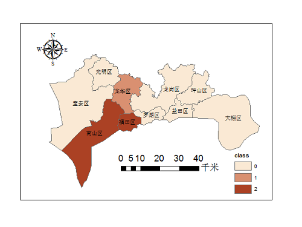

图4-3 时空扫描聚集图

 
 
 
 

# 5疫情分布的影响因素分析

##
 
 

**5.1模型介绍**

&emsp;&emsp;在上一次报告中，我们对深圳市各区建立了空间自回归模型，分析了GDP，人口密度，区位功能等社会经济因素对其疫情空间分布的影响。
这一次我们将研究范围扩大，选取了广东省21个市级地区建立空间计量模型，并对整个深圳地区的空间效应进行重点分析。

**5.1.1模型理论**

- Anselin给出了空间回归模型的一般形式：
$$Y=\rho W_1Y+X\beta+u$$

&emsp;&emsp;&emsp;&emsp;&emsp;&emsp;&emsp;&emsp;$u=\lambda W_2\varepsilon+\mu$ &emsp;&emsp;&emsp;&emsp;$\mu\sim N[0,\sigma^2I]$

&emsp;&emsp;其中，$Y$是因变量，$X$是解释变量，$\beta$表示解释变量的空间回归系数，$u$是随空间变化的误差项，$\mu$是白噪声，$W_1$是反映因变量自身空间趋势的空间权重矩阵，$W_2$为反应残差空间趋势的空间权重矩阵，通常根据邻接关系或者距离函数关系确定空间权重矩阵。$\rho$为空间滞后项的系数，其值为0到1，越接近1，说明相邻地区的因变量取值越相似，$\lambda$为空间误差系数，其值为0到1，越接近于1，说明相邻地区的解释变量取值越相似，其中$W_1$可以等于$W_2$。

---

- 5种模型的对比
$$Y=\rho W_1Y+X\beta+u$$

$u=\lambda W_2\varepsilon+\mu$ &emsp;&emsp;&emsp;&emsp;$\mu\sim N[0,\sigma^2I]$

 

- 当$\rho=0$，$\lambda=0$时，为普通线型回归模型

- 当$\rho\neq0$,$\beta=\lambda=0$时，为一阶空间自回归模型

- 当$\rho\neq0$，$\beta\neq0$，$\lambda\neq0$时，模型为空间滞后模型

- 当$\rho=0$，$\beta\neq0$,$\lambda=0$时，为空间误差模型

- 当$\rho\neq0$，$\beta\neq0$，$\lambda\neq0$时，为空间杜宾模型

##
 
 

**5.2变量选择**

&emsp;&emsp;为深入研究社会经济因素对深圳及其周边地区疫情分布的影响，我们选取各市累计确诊人数（Yi）作为模型因变量，相邻地级市确诊人数(Yj)、本地生产总值（GDP）、人口密度（pd）、1月份由武汉市流入的平均人口数（flow）作为自变量。其中，

&emsp;（1）因变量（Yi）为2月29日广东省21个地级市的累计确诊人数，在这一时点各市疫情已接近尾声，累计确诊人数的空间自相关性显著，可用于建立空间计量模型对其分析。

&emsp;（2）相邻地区确诊人数(Yj)是模型的空间滞后项（spatiallag），这一变量使模型增加了空间效应，可用以分析相邻地区确诊人数的相互影响。

&emsp;（3）GDP是各2019年的生产总值(单位为亿元)，它是经济繁荣程度的代理变量，可研究疫情空间分布与经济发展的相互关系。

&emsp;（4）pd是人口密度，采用各行政区每平方公里的年末常住人口数表示，此变量采用“百人/平方公里”为单位进行衡量。

&emsp;（5）1月份由武汉市流入的每日平均人口数（flow）是潜在传播风险的代理变量，与武汉人流来往越密切的城市，爆发疫情的潜在风险也越大。

&emsp;各市GDP、人口密度数据查询自广东省统计局官网，人口流动数据来自于百度迁徙。

---

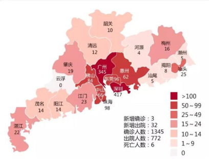

表5-1变量描述统计结果

|变量名称|定义|单位|平均数|标准差|最小值|最大值|
|:----------:|:----------:|:------:|:-----:|:------:|:------:|:------:|
|总产出（GDP）|生产总值|亿元|5135.117|7187.182|921.96|26927.09|             
|人口密度（pd）|每平方公里年末常住人口数|百人/平方公里|1237.714|1511.795|163|6522|
|流入人口（flow）|由武汉市流入的每日平均人口数|人|407.7143|827.5362|23|3403|

##

**5.3模型检验**

**5.3.1空间自相关检验**

&emsp;&emsp;在经典线性回归模型中加入空间效应前，要对各市累计确诊人数进行空间自相关检验。在此继续使用全局Moran'sI测度变量的地理分布是否存在空间自相关性(表5-2)。

表5-2空间自相关性检验结果

<table border="1" cellspacing="0">
|变量名称|Moran's I|P-value|
|:---:|:---:|:---:|
|累计确诊人数|0.266|0.039|

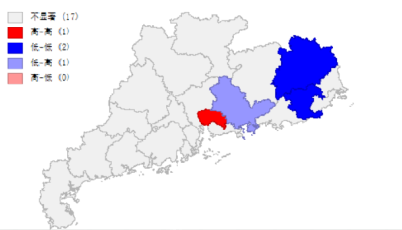

&emsp;&emsp;各市累计确诊人数的Moran'sI值均通过了显著性检验，具有明显的空间依赖性。

##

**5.3.2模型选择**

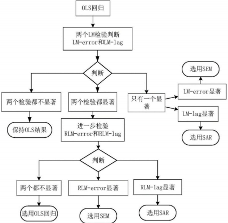

LM检验用来判断是否有必要使用空间计量模型，并帮助选择适合该研究的模型类别。

---

&emsp;&emsp;设定普通线性回归模型为$$confirm=lnGDP+PD+flow$$

&emsp;&emsp;在Stata软件对其回归，进行LM检验，结果如下：

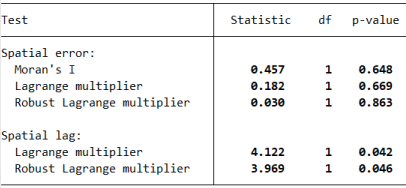

&emsp;&emsp;根据检验流程，首先关注LM-error和LM-lag的检验结果，这两个检验的原

假设分别表示误差项不存在空间相关性或空间滞后被解释变量没有空间相关性,根据上表

，拒绝了空间滞后被解释变量没有空间相关性的原假设，同时通过了稳健的LM-lag检

验，所以，最后选择空间滞后模型。

##

**5.3.3模型设定**

&emsp;&emsp;通过上述检验，最终建立空间自回归模型（SAR），具体设定如下：

$$Y_i=\rho\sum_{j=1}^nW_{ij}Y_j+\beta_1lnGDP_i+\beta_2PD_i+\beta_3flow_i+\beta_0+\varepsilon_i$$

&emsp;&emsp;其中，$W_{ij}$为空间权重矩阵，在此使用理论部分定义的空间0-1邻接矩阵，$\rho$指本地

确诊人数与相邻地区确诊人数空间相互作用的方向和程度，$\beta_0$是模型系数,$lnGDP$、

$PD$、$flow$分别表示各市2019年的生产总值、人口密度、武汉流入人数；$\beta_1$、$\beta_2$、

$\beta_3$分别为各变量对应的影响系数。。

##

**5.4模型解读**

**5.4.1模型估计**

- 选择广义空间二阶最小二乘法（GS2sls）对各参数进行估计，估计结果如下：

表5-3空间自回归模型结果

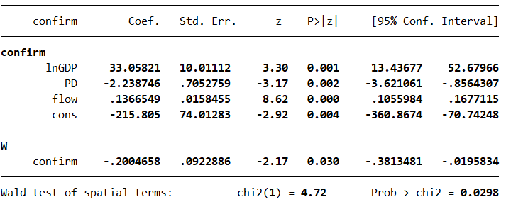

&emsp;&emsp;由上表可知，空间权重系数为-0.201,P值小于0.05,表示存在显著的负向空间效应；关于疫情的分布特征，确诊人数（confirm）与经济发展因素（lnGDP）存在正相关关系，且P值小于0.05,高度显著，表示该地区GDP每增加1%时，本地确诊人数平均增加0.33个单位。武汉流入人数（flow）也同确诊人数（confirm）存在显著的正向关系。

## 

**5.4.2 空间溢出效应**

&emsp;&emsp;接下来将重点分析要素变化产生的空间溢出效应，即某一地区各因素变化，对其他地区确诊人数的影响，根据偏微分法，测算因空间依赖而产生的直接效应、间接效应及总效应。表5-4显示了基于偏微分方法对溢出效应进行分解之后的结果：

表5-4空间自回归模型直接效应和溢出效应分解

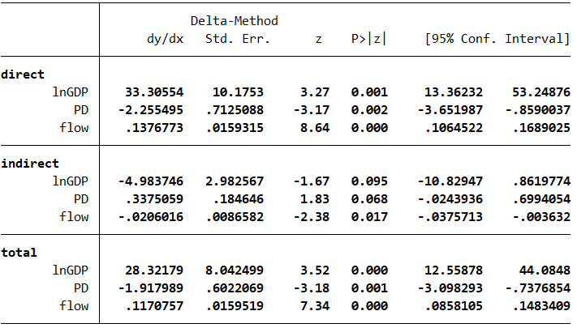

---

- 总效应=直接效应+间接效应

- 总效应可以分解为两部分：一是直接效应即本地效应，表示本区域社会经济情况对

本地确诊人数的影响；二是间接效应，也就是空间溢出效应，表示本区域社会经济因

素对相邻地区确诊人数的影响。根据表5-4的分解结果可知dy/dx是各个自变量对因变

量的边际效应，接下来以从武汉流入各城市的平均人口数(flow)为例进行说明：

- 直接效应下的flow系数为0.14,表示当疫情爆发地流入本地的平均人数增加1个单位时,
  
  本地感染人数平均增加0.14个单位；

- 间接效应下的flow系数为-0.02,即从武汉流入各城市的平均人数增加1个单位时，相邻

地区感染人数平均减少0.02个单位。可见，流入人口（flow）存在一定的负向空间溢出效

应，因此在疫情期间严禁人口聚集及流动是控制疫情空间蔓延的有力措施。

## 

**5.4.3 空间溢出效应实例**

&emsp;&emsp;选定深圳市为溢出中心，如果武汉来深人数由实际情况3304人下降到2000人
时,其它地区的确诊人数会如何变化?
 - 根据之前估计的模型，分下面三步解决这个问题。
 
 1. 基于原始的数据，通过估计出的模型预测各市的确诊人数。
 2. 将武汉来深人数减少到2000（下降了1403个单位）,再次预测各市的确诊人数。
 3. 计算两次预测值的差值，将差值绘制在广东省的地图上。

## 

**5.5 政策分析**

&emsp;&emsp;假定每个城市的武汉流入人数（flow）都下降一个单位时，预测广东省平均确诊人数的变动情况，下表显示预测前后的结果，平均确诊人数从66.25下降至66.13人。

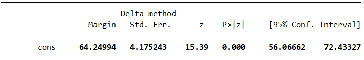

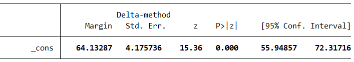

&emsp;&emsp;从疫情中心流入的人数降低就相当于减少了潜在的感染源，人群感染风险也相应减小,进而间接影响了周围地区的确诊人数。因此，武汉的封城政策是防止疫情进一步恶化的关键措施，疫情期间政府应当严格控制人口流动，减少聚集性活动。

 
 
 
 

# 6.结论和展望

---

**6.2 建议**

&emsp;&emsp;本文为深圳市应对传染病传播提供以下防控建议：

 **1.建立传染病监测长效机制**

- 实时监测与防控各区流动人口状态，关注人流量大的场所
- 及时登记小区、单位出入人员健康状况
- 追踪境外输入人员的时空轨迹、健康情况、疫源地暴露史等信息
- 重点关注和预判各片区诊疗情况、资源配置等的变化，优化调整防控措施

 **2.众志成城、共同“防疫”**

- 规范个体行为。运用新媒体平台传播疫情动态、防疫政策，提升公民“抗疫”意识。
- 增强家庭参与。家庭应建立“突发事件应急预案”，理性看待突发事件，掌握应对知识与方法。
- 扩大社会参与度。利用5G、AI、大数据等技术开发智能防疫设施，如无感测温设备、机器人消毒装备、智能化监测评估防疫系统等，降低防疫过程中医护人员的感染风险
- 规范数据收集方式。消除不同部门间“信息孤岛”，释放数据价值和潜力，达到疫情精准防控目标。

---

**6.1 结论**

 **1.流行病学特征**

- 确诊病例性别分布趋于均衡，总体覆盖全年龄段

- 年长的人接触湖北病例的可能性高

- 深圳市感染人群以外部输入为主,居住地在深圳市的感染者占比最高

 **2.时间演化和染病特征**

 （1）时间特征：
 
- 深圳市的每日新增确诊人数变化分四个阶段

- 1月31日是深圳市疫情爆发的峰值

 （2）染病特征分析
 
- 社会网络关系：深圳市聚集性确诊病例以家庭间传播为主

---

 **3.空间聚集特征分析**

（1）空间关联特征

- 深圳市的累计确诊人数分布呈现西高——东低态势，其时空分布经历了由零星发散到大范围聚集再到零星发散的过程

（2）空间聚集特征

- 疫情小区在空间呈现东北—西南走向，在福田区和南山区南部形成“两核”

- 时空扫描分析：疫情主要重灾区为南山区、福田区，时间为1月22日-1月30日

 **4.空间分布的影响因素分析**

- 深圳市作为广东地区确诊人数最多的城市，与其频繁的人口迁徙流动是密不可分

- 通过空间自回归模型，发现深圳市疫情分布与各行政区经济发展状况、人口密度、区位功能等社会经济因素有高度空间相关性，且确诊人数在相邻区域内存在空间溢出效应。

---

 
 
 
 

# Thank you!