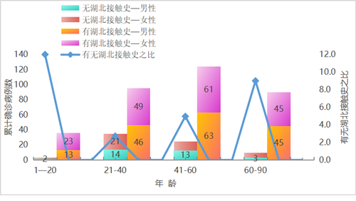
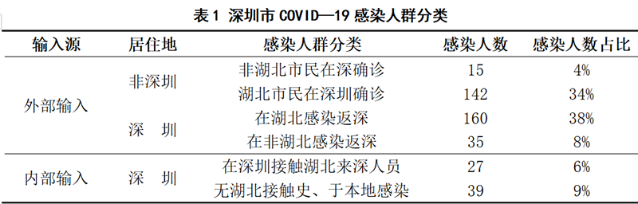
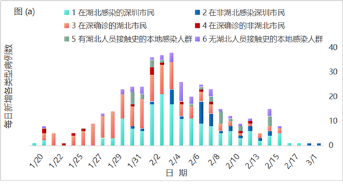
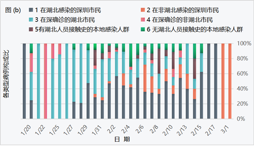

##
 
 

**演讲内容**

### 1.研究背景及意义

### 2.流行病学分析

### 3.时间特征分析

### 4.空间特征分析

#### 4.1 空间自相关

#### 4.2 空间自回归模型

 
 
 
 

# 1.研究背景及意义
##
 
 

**1.1 研究背景**

- 纵观当下，COVID—19已蔓延到全球200个国家和地区，已成为一起严重的全球性突发公共卫生事件，早日抑制疫情发展、恢复社会活力是全球人民的共同愿望。

- 目前学术界在病原学、流行病学、传播动力学和防疫策略等领域都已取得丰富成果，但从地理空间视角探索疫情时空演化、地区风险评估的研究较少。

- 而疫情在人群与地域的传播扩散是典型时空演化与人地互动的地理过程，与2003年SARS疫情相比,COVID-19疫情的传播范围和影响层面更广，因此运用空间计量分析方法研究新型冠状病毒的时空演变特征及影响因素，对疫情现实防控有积极作用。

##
 
 

**1.2 文献综述**

-  胡碧松等（2010）利用空间分析与网络分析方法研究了北京市外部输入输出流的高风险时空热点以及网络结构，揭示了SARS流行过程中的潜在时空演化规律及个体与区域之间的传播特性，反映了疾病在宏观区域内的传播特点。

- 张人杰等（2019）以浙江省 2013 —2016年感染H7N9禽流感病例以及病毒外环境监测数据为基础，结合相关的社会、环境数据，运用空间自相关分析和热点分析等方法分析疫情的空间分布模式，运用地理加权回归模型（GWR）分析禽流感病例数与人口密度、家禽密度以及外环境病毒分布的关系。

- 关于COVID-19疫情的时空传播研究，徐小可等（2020）基于人口流动数据，对疫情暴发前期武汉市外流人口的去向进行分析，探寻了离汉人员对疫情传播的影响。

##
 
 

**1.3 研究主题**

- 本文拟利用深圳市卫生健康局公开的418例确诊病例数据及深圳市地理信息数据，综合应用描述性统计分析、logistic回归分析、空间计量分析和社会网络分析等方法

- 全面探讨深圳市COVID-19流行病学特征和疫情传播的空间自相关性、异质性及时空演化规律

- 对深圳市外部输入病例、内部输入病例的疾病传播网络展开时空演化分析与网络特征分析

- 并基于空间自回归模型对深圳市人口变动和GDP变动做政策分析和空间溢出效应分析

- 为之后研究疫情预警机制提供基础，也为研究国内外疫情传播规律提供参考

 
 
 
 
# 2.流行病学分析

##
 

**2.1感染人群结构特征**

 - 深圳市市418名感染者中人数最多的年龄组为41—60岁，共61人；最少的为1—20岁，共23人。
 - 感染人群中女性占比略多于男性
 - 各年龄组患者中，有湖北接触史的人数明显高于无湖北接触史人数，且二者之比呈倍数关系
 - 后3组的有无湖北接触史之比呈递增态势，说明年长者接触湖北病例的可能性更高

##
 

**2.2感染人群分类特征**

&emsp;&emsp;按病例输入源和居住地可以将深圳市感染人群分为如下6类

 - 感染者输入源看，深圳市感染人群以外部输入为主，共352例，占比为84%
 - 从感染者居住地看，居住地在深圳市的感染者有261例，占比62%
 - 深圳市居民在外感染返深人群为195，占比为47%
 
##
 

**2.3深圳市各区病例空间分布特征**

 - 居住地为深圳市的累计确诊人数分布呈现西高——东低态势，西部为重灾区，东部为“免疫区”
 - 福田区、南山区累计确诊人数最多；坪山区、大鹏区、盐田区累计确诊人数最少
 - 原因： 西部地区地势平缓、经济发达、人口密度大;东部地形多为山地、经济欠发达
 

 
 
 
 

# 3.时间演变特征分析

##

**3.1 整体时间演变特征**

 - 深圳市的每日新增确诊人数呈阶段性变化特征
 - 1月19日—1月23日是初始偶发期（第一阶段）；1月24日—2月3日为快速增长期（第二阶段）
 - 2月4日—2月15日为波动下降期（第三阶段）；2月16日—3月1日为平稳收缩期（第四阶段）
 - 外部输入病例：每日新增数量多，波动大，在2月3日达到峰值；内部输入病例：日增量少，波动小。在2月4日达到峰值。初步判断，2月3日左右是深圳市疫情爆发的峰值
 
##
**3.2不同感染人群的时间演变特征**

- 从外部输入角度看：第一类是在湖北感染的深圳市民,这类感染人群占比最高，多是在武汉探亲感染；返深后，进一步引发家庭聚集性传染。
- 第二类是非湖北地区感染的深圳市民,人数少、占比低。除2月3日、6日外，其他日期新增确诊人数均没超过5例。 
- 第三类是在深确诊的湖北市民，此类人群累计确诊人数达142例，仅次于第一类人群。
- 第四类是在深圳确诊的非湖北人员，他们多接触过湖北人员，日增确诊病例数最少。
- 从内部输入角度看：第五类是在深圳本地接触湖北人员的感染人群;第六类是无湖北人员接触史的本地感染人群。两类人群每日新增确诊病例都比较少，占比低。

##

**3.2不同感染人群的时间演变特征**

- 从外部输入角度看：第一类人群每日新增人数构成比在1月27日-2月17日期间呈现波动上升，2月16日、17日占比100%。
- 第二类人群构成比从第二阶段开始有所提升，2月21日、3月1日占比达100%。
- 第三类人群构成比在疫情发展前两个阶段占比高，后两个阶段占比低，可能是由于湖北封城。
- 第四类人群构成比在第一阶段有所体现，1月21日占比达100%，但整体看占比小，
- 从内部输入角度看：第五、第六类人群占比低，且都在第二、第三阶段有所体现。
