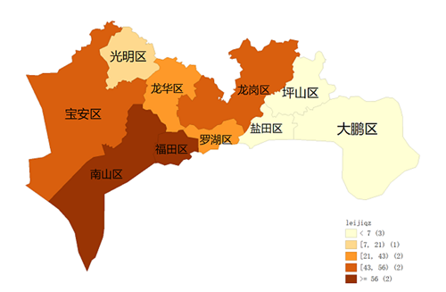
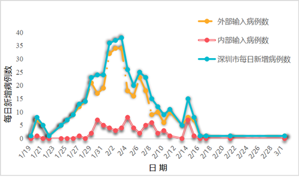
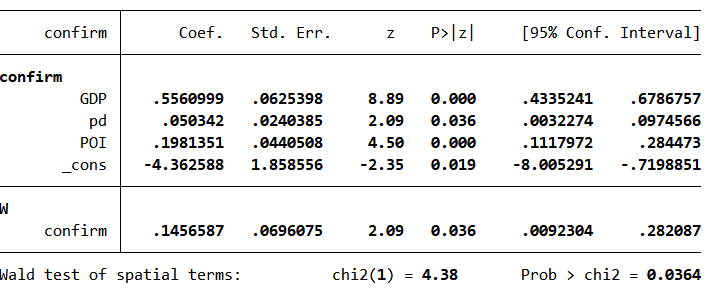
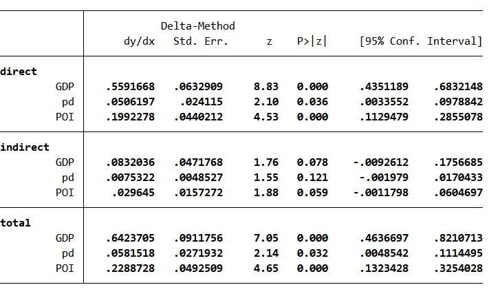

##
 
 

**演讲内容**

### 1.引言

### 2.流行病学分析

### 3.时间特征分析

### 4.空间特征分析

&emsp;4.1 空间自相关

&emsp;4.2 空间自回归模型

 
 
 

**引言**

 
 
 
 

# 2.流行病学分析

##
 
 

**2.1感染人群结构特征**

 - 深圳市市418名感染者中人数最多的年龄组为41—60岁，共61人；最少的为1—20岁，共23人。
 - 感染人群中女性占比略多于男性
 - 各年龄组患者中，有湖北接触史的人数明显高于无湖北接触史人数，且二者之比呈倍数关系
 - 后3组的有无湖北接触史之比呈递增态势，说明年长者接触湖北病例的可能性更高

##
 
 

**2.2感染人群分类特征**

&emsp;&emsp;按病例输入源和居住地可以将深圳市感染人群分为如下6类

 - 感染者输入源看，深圳市感染人群以外部输入为主，共352例，占比为84%
 - 从感染者居住地看，居住地在深圳市的感染者有261例，占比62%
 - 深圳市居民在外感染返深人群为195，占比为47%
 
##
 
 

**2.3深圳市各区病例空间分布特征**

 - 居住地为深圳市的累计确诊人数分布呈现西高——东低态势，西部为重灾区，东部为“免疫区”
 - 福田区、南山区累计确诊人数最多；坪山区、大鹏区、盐田区累计确诊人数最少
 - 原因： 西部地区地势平缓、经济发达、人口密度大;东部地形多为山地、经济欠发达
 
 
 
 
 
 

# 3.时间特征分析

##

**3.1 整体时间演变特征**

 - 深圳市的每日新增确诊人数呈阶段性变化特征：1月19日—1月23日是初始偶发期（第一阶段）；1月24日—2月3日为快速增长期（第二阶段）
 - 2月4日—2月15日为波动下降期（第三阶段）；2月16日—3月1日为平稳收缩期（第四阶段）
 - 外部输入病例：每日新增数量多，波动大，在2月3日达到峰值；内部输入病例：日增量少，波动小。在2月4日达到峰值。因此，初步判断，2月3日左右是深圳市疫情爆发的峰值
 

 
 
 
 

# 4.空间特征分析

##
 
 

**4.2空间自回归模型**

### 4.2.1模型理论

&emsp;&emsp;与传统回归模型相比，空间计量模型使用的数据比较丰富，包含的变量之间有更多的变化，且具有少共线性的特征。模型的结果具有更大的自由度，从而提高了估计的效率,空间面板模型还考虑了空间单元之间的互动即自相关性，它假定因变量取决于相邻的空间单元变量的值。空间面板模型表示为:
$$y_{it}=\rho\sum_{j=1}^nW_{ij}y_{it}+\beta X_{it}+\mu_{it}+\varepsilon_{it} $$

&emsp;&emsp;其中$i$是数据的空间维度,$t$是数据的时间维度,$y_{it}$是在空间单元i和时间t上的因变量,$X_{it}$是在空间单元i与时间t上的自变量,$\mu_{it}$是空间的个体效应，表示不受时间影响的空间自身特质,$\beta$是空间回归系数，它主要反映了空间独立自变量与因变量之间的关系,$W_{ij}$是空间权重矩阵，本研究中采用空间邻接矩阵表示区域数据集之间的空间相邻关系，若区域i与区域j是直接相邻的关系，$W_{ij}=1$,否则$W_{ij}=0$,$\rho$是空间自回归系数，其反映了空间领域间的影响,$\varepsilon_{it}$是与空间和时间都有关系的随机误差项，其服从均值为0,方差为$\sigma^2$的正态分布且独立同分布。

---

### 4.2.2变量选取与数据来源

&emsp;&emsp;为深入研究上述社会经济因素对疫情空间分布的影响，这部分研究选取各区累计确诊人数（Yi）作为模型因变量，相邻行政区确诊人数(Yj)、本地生产总值（GDP）、人口密度（pd）、区位功能综合得分（POI）作为自变量。其中，

&emsp;（1）因变量（Yi）为2月3日各行政区累计确诊人数，选取这一时点的原因是此时各行政区的疫情发展已呈现出明显趋势，空间自相关性显著，可用于建立空间计量模型对其分析；此外，疫情并未处于峰值，还有一定的发展空间，便于进一步分析空间溢出效应。

&emsp;（2）相邻行政区确诊人数(Yj)是模型的空间滞后项（spatial lag），这一变量使模型增加了空间效应，用以分析相邻地区确诊人数的相互影响，解释疫情在空间上所呈现出的蔓延趋势。

&emsp;（3）GDP是各行政区2019年的生产总值(单位为百亿元)，它是经济繁荣程度的代理变量，将GDP引入模型，可研究疫情空间分布与经济发展的相互关系。

&emsp;（4）pd是人口密度，采用各行政区每平方公里的年末常住人口数表示，为更好地反映人口密度变化对确诊人数的影响，此变量采用“百人/平方公里”为单位进行衡量。

---

&emsp;（5）区位功能综合得分（POI）是潜在传播风险的代理变量，POI功能越混杂且位置数越多的行政区，综合得分越高，潜在传播风险越大。在计算区位功能综合得分（POI）时，本文基于百度地图POI数据，先将POI功能归纳为市政、住宅、新兴企业、轻工业、重工业、消费娱乐、医疗7大类，并统计出各行政区内相应POI功能的位置个数，按照新兴企业、轻工业、重工业、消费娱乐风险高，住宅、市政风险中，医疗风险低赋予相应权重，最终加权求得各行政区人群聚集区域综合得分，得分范围[0,100],分数越高，对应的人群聚集活跃度越大，相应的感染风险也会增加。

&emsp;&emsp;各行政区GDP、人口密度数据查询自2019年《深圳市统计年鉴》，POI
数据来自于百度地图。

表4-1变量描述统计结果

|变量名称|定义|单位|平均数|标准差|最小值|最大值|
|:----------:|:----------:|:------:|:-----:|:------:|:------:|:------:|
|总产出（GDP）|生产总值|百亿元|25.622|23.418|2.39|70|
|人口密度（pd）|每平方公里年末常住人口数|百人/平方公里|59.417|54.730|4.131|192.817|
|区位功能综合得分（POI）|人群聚集区域综合得分|分|45.255|31.086|6.358|96.020|

---

### 4.2.3模型检验

&emsp;&emsp;在经典线性回归模型中加入空间效应，还需要对生产总值（GDP）、人口密度（pd）、区位功能综合得分（POI）这三个变量进行空间自相关检验。在此继续使用全局Moran'sI度量各变量的地理分布是否存在空间自相关性(表4-2)。

表4-2变量的空间自相关性检验结果

<table border="1" cellspacing="0">
|变量名称|Moran's I|P-value|
|:---:|:---:|:---:|
|GDP|0.266|0.039|
|pd|0.356|0.011|
|POI|0.351|0.020|

&emsp;&emsp;从4-2可以看出，三个变量的Moran'sI值均通过了显著性检验，表明生产总值（GDP）、人口密度（pd）、区位功能综合得分（POI）具有明显的空间依赖性，结合局部自相关LISA分布图可发现，POI变量存在一个显著异常点，为呈现“低-高”聚集情况的龙华区，其余位点均表现为空间正相关，“高-高”聚集区域主要位于西部的南山区，“低-低”聚集区域主要为东部的大鹏新区及坪山区。

---

### 4.2.4模型设定

&emsp;&emsp;通过空间正自相关性检验，上述变量正自相关性显著，在地理空间中存在明显聚，因此可将空间效应引入经典线性回归，建立空间自回归模型（SAR），具体设定如下：
$$Y_i=\rho\sum_{j=1}^nW_{ij}Y_j+\beta_1GDP_i+\beta_2pd_i+\beta_3POI_i+\beta_0+\varepsilon_i$$

&emsp;&emsp;其中，$W_{ij}$为空间权重矩阵，在此使用理论部分定义的空间邻接矩阵，$\rho$指本地确诊人数与相邻地区确诊人数空间相互作用的方向和程度，$\beta_0$是模型系数,$GDP$、$pd$、$POI$分别表示各行政区2019年的生产总值、人口密度、区位功能综合得分；$\beta_1$、$\beta_2$、$\beta_3$分别为生产总值、人口密度、区位功能综合得分的影响系数。

---

### 4.2.5模型估计

&emsp;&emsp;此模型选择广义空间二阶最小二乘法（GS2sls）对其各参数进行估计，估计结果如下：

表4-3空间自回归模型结果

&emsp;&emsp;从空间自回归模型结果中可以看出，空间权重即空间依赖性的系数为0.146, P值小于0.05,表示有相邻影响效应的存在且高度显著，风险因素分析表明总产出（GDP）与疫情确诊人数（confirm）存在正相关关系，且P值小于0.05高度显著，这表明该地区GDP每增加一个单位（百亿元），本地确诊人数平均增加增加0.56个单位（人）。此外，人口密度（pd）、区位功能综合得分（POI）也同确诊人数（confirm）存在正相关关系，且显著。随着人口密度以及区位功能重要性的增大，该地确诊人数也随之增加。

---

&emsp;&emsp;接下来将重点分析要素变化产生的空间溢出效应，即某一地区各因素变化，对其他地区确诊人数的影响，参考$Lesage$和$Pace$提出的偏微分法，测算因空间依赖而产生的直接效应、间接效应及总效应。表4-4显示了基于偏微分方法对溢出效应进行分解之后的结果：

表4-4空间自回归模型直接效应和溢出效应分解

---

&emsp;&emsp;总效应可以分解为两部分：一是直接效应即本地效应，表示本区域社会经济发展程度对本地确诊人数的影响；二是间接效应，即溢出效应，表示本区域社会经济因素对相邻地区确诊人数的影响。根据表4-4的分解结果可知dy/dx是各个自变量对因变量的边际效应，接下来以人口密度pd为例进行说明：

&emsp;&emsp;直接效应下的pd系数为0.05,在1%的水平下显著，即本地每平方公里上增加100人,本地感染人数平均增加0.05人；

&emsp;&emsp;间接效应下的pd系数为0.007,在1%的水平下显著，即本地每平方公里上增加100人，相邻地区感染人数平均增加0.007人。可见，人口密度变化存在显著的空间溢出效应，因此在疫情期间严禁人口聚集及流动是控制疫情空间蔓延的强有力措施。

