##
 

**演讲内容**

 

#### 1.研究背景及意义

 

#### 2.流行病学特征分析

 

#### 3.时间演化特征分析

 

#### 4.空间特征分析

 

#### 5.空间溢出效应

 

#### 6.结论与展望

 
 
 
 

# 1.研究背景及意义
##
 
 

**1.1 研究背景**

- 纵观当下，COVID—19已蔓延到全球200个国家和地区，已成为一起严重的全球性突发公共卫生事件，早日抑制疫情发展、恢复社会活力是全球人民的共同愿望。

- 目前学术界在病原学、流行病学、传播动力学和防疫策略等领域都已取得丰富成果，但从地理空间视角探索疫情时空演化、地区风险评估的研究较少。

- 而疫情在人群与地域的传播扩散是典型时空演化与人地互动的地理过程，与2003年SARS疫情相比,COVID-19疫情的传播范围和影响层面更广，因此运用空间计量分析方法研究新型冠状病毒的时空演变特征及影响因素，对疫情现实防控有积极作用。

##
 
 

**1.2 文献综述**

-  胡碧松等（2010）利用空间分析与网络分析方法研究了北京市外部输入输出流的高风险时空热点以及网络结构，揭示了SARS流行过程中的潜在时空演化规律及个体与区域之间的传播特性，反映了疾病的传播特点。

- 张人杰等（2019）以浙江省 2013 —2016年感染H7N9禽流感病例以及病毒外环境监测数据为基础，运用地理加权回归模型（GWR）分析禽流感病例数与人口密度、家禽密度以及外环境病毒分布的关系。

- 关于COVID-19疫情的时空传播研究，徐小可等（2020）基于人口流动数据，对疫情暴发前期武汉市外流人口的去向进行分析，探寻了离汉人员对疫情传播的影响。

- 刘郑倩等（2020）利用珠海市卫健局发布的98例新冠病毒病例流据,通过26个疫情聚集单元
的时空特征分析和4类典型传播路径的案例剖析，探讨了珠海市新冠肺炎聚集发生的时空规律和传播路径。
- 苏理云（2020）运用空间统计方法揭示了中国各省累计确诊人数的静态空间分布和动态演变规律。

##
 
 

**1.3 研究主题**

- 本文拟利用深圳市卫生健康局公开的418例确诊病例数据及深圳市地理信息数据，综合应用描述性统计分析、logistic回归分析、空间计量分析和社会网络分析等方法

- 全面探讨深圳市COVID-19流行病学特征和疫情传播的空间自相关性、异质性及时空演化规律

- 对深圳市外部输入病例、内部输入病例的疾病传播网络展开时空网络特征分析

- 并基于空间自回归模型对深圳市人口密度变动和GDP变动做政策分析和空间溢出效应分析

- 为之后研究疫情预警机制提供基础，也为研究国内外疫情传播规律提供参考

 
 
 
 

# 2.流行病学分析

##
 

**2.1感染人群结构特征**

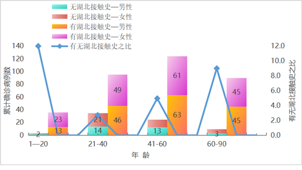

 - 深圳市市418名感染者中人数最多的年龄组为41—60岁，共61人；最少的为1—20岁，共23人。
 - 感染人群中女性占比略多于男性
 - 各年龄组患者中，有湖北接触史的人数明显高于无湖北接触史人数，且二者之比呈倍数关系
 - 后3组的有无湖北接触史之比呈递增态势，说明年长者接触湖北病例的可能性更高

##
 

**2.2感染人群分类特征**

&emsp;&emsp;按病例输入源和居住地可以将深圳市感染人群分为如下6类

 - 感染者输入源看，深圳市感染人群以外部输入为主，共352例，占比为84%
 - 从感染者居住地看，居住地在深圳市的感染者有261例，占比62%
 - 深圳市居民在外感染返深人群为195，占比为47%
 
##
 

**2.3深圳市各区病例空间分布特征**

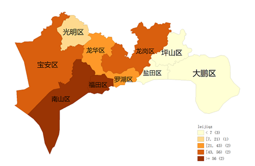

 - 居住地为深圳市的累计确诊人数分布呈现西高——东低态势，西部为重灾区，东部为“免疫区”
 - 福田区、南山区累计确诊人数最多；坪山区、大鹏区、盐田区累计确诊人数最少
 - 原因： 西部地区地势平缓、经济发达、人口密度大;东部地形多为山地、经济欠发达
 

 
 
 
 

# 3.时间演变特征分析

##

**3.1 整体时间演变特征**

 - 深圳市的每日新增确诊人数呈阶段性变化特征
 - 1月19日—1月23日是初始偶发期（第一阶段）；1月24日—2月3日为快速增长期（第二阶段）
 - 2月4日—2月15日为波动下降期（第三阶段）；2月16日—3月1日为平稳收缩期（第四阶段）
 - 外部输入病例：每日新增数量多，波动大，在2月3日达到峰值；内部输入病例：日增量少，波动小。在2月4日达到峰值。初步判断，2月3日左右是深圳市疫情爆发的峰值
 
##
**3.2不同感染人群的时间演变特征**

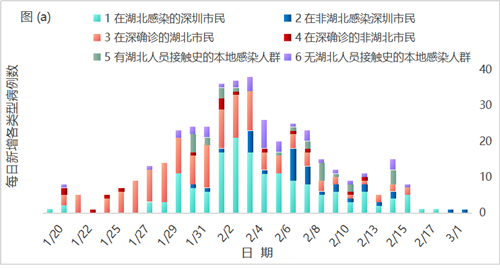

- 从外部输入角度看：第一类是在湖北感染的深圳市民,这类感染人群占比最高，多是在武汉探亲感染；返深后，进一步引发家庭聚集性传染。
- 第二类是非湖北地区感染的深圳市民,人数少、占比低。除2月3日、6日外，其他日期新增确诊人数均没超过5例。 
- 第三类是在深确诊的湖北市民，此类人群累计确诊人数达142例，仅次于第一类人群。
- 第四类是在深圳确诊的非湖北人员，他们多接触过湖北人员，日增确诊病例数最少。
- 从内部输入角度看：第五类是在深圳本地接触湖北人员的感染人群;第六类是无湖北人员接触史的本地感染人群。两类人群每日新增确诊病例都比较少，占比低。

##

**3.2不同感染人群的时间演变特征**

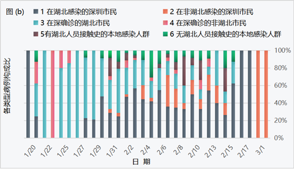

- 从外部输入角度看：第一类人群每日新增人数构成比在1月27日-2月17日期间呈现波动上升，2月16日、17日占比100%。
- 第二类人群构成比从第二阶段开始有所提升，2月21日、3月1日占比达100%。
- 第三类人群构成比在疫情发展前两个阶段占比高，后两个阶段占比低，可能是由于湖北封城。
- 第四类人群构成比在第一阶段有所体现，1月21日占比达100%，但整体看占比小，
- 从内部输入角度看：第五、第六类人群占比低，且都在第二、第三阶段有所体现。

# 4.空间特征分析

##
 
 

**4.1空间自相关分析**

 
 

- 传染病在空间上的传播扩散与人口分布、环境及其他各类空间因子息息相关,感染者之间非完全独立, 有一定的空间依赖性。

- 因而经典的相关性分析方法并不适用于传染病空间特征的分析，因此运用空间相关性分析来分析新型冠状病毒传播的空间关联关系, 即对象与邻近对象之间的共变特征。

##
 
 

**4.1.1全局空间自相关**

&emsp;&emsp;全局空间自相关是从宏观的角度研究观测值在空间上的分布特征。本文运用全局 Moran’s I 来分析深圳市新型冠状病毒感染人群的空间自相关性。

&emsp;&emsp;上式中，$I$为全局Moran指数，$n$为行政区个数;$X_i$、$X_j$为区域$i$、$j$的累计确诊人数。 $W_{ij}$为空间权重矩阵，用来度量空间单元之间的邻近关系，两地相邻为1，不相邻为0。$S^2$为累计确诊人数观测值的方差， $\overline{x}$为累计确诊人数的平均值。

&emsp;&emsp;全局 Moran’s I指数反映观测值在空间近邻时相似程度的大小，取值范围为[-1,1]，绝对值越大表示相关性越强。当指数为正值时，相邻地区间的观测值相似，空间正相关；当指数为负值时，为空间负相关；当指数取0时，相邻地区无空间相关性，空间上呈随机分布。

##
 
 

**4.1.2局部空间自相关**

&emsp;&emsp;Moran’ I 指数只能从整体上对空间相关性进行平均度量,它无法反映空间异质情况时各个分区的空间聚类情况。因此运用LISA指数进行局部自相关分析，揭示区域变量的局部异常聚集状况与局部不稳定性特征。

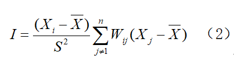

&emsp;&emsp;式中各元素含义与（1）式同。LISA集聚图能够定量反映出空间上的 4 种聚类特征: 

① 高值聚集 (高-高)-高风险值的空间统计单元邻近的周围区仍然是高值，为空间正相关；

② 低值聚集(低-低)-低风险值的空间统计单元邻近的周围区域仍然是低值，为空间正相关；

③ 高低聚集(高低)-高风险值的空间统计单元邻近的周围区域是低值，为空间负相关；

④ 低高聚集(低-高)-低风险值的空间统计单元邻近的周围区域是高值，为空间负相关。

##

**4.1.3全局空间自相关析**

##
 
 

 **1.整体态势**

- 本文运用Geoda对深圳市感染人群各特征值的Moran’s I指数及其P值、Z值，检验其显著性。其中，累计确诊人数的 Moran’s I统计指数为0.320，零假设$H_0$: 累计确诊人数在空间上完全随机分布, 根据零假设进行999次Monte Carlo随机模拟得到Moran’s I的z-score为2.132,P<0.05,表明深圳市累计确诊人数在空间上显著正相关。

- 居住地为深圳的外部输入和内部输入都是空间自相关，但是前者空间相关性高于后者。可能由于外部输入的患者是一代感染者，内部输入中有一部分人是受一代病例传染的二代感染者，因此其空间相关性相对较低。

##
 
 

 **2.其他特征**

&emsp;&emsp;由于性别、年龄、有无湖北直接接触史、发病时间都会对疫情空间传播模式产生影响， 因此本文对这些影响因子也进行全局空间自相关分析。

- 性别：女性患者的空间相关性高于男性，可能由于女性活动范围比男性小、活动空间更集中。

- 有无湖北直接接触史：有、无湖北直接接触史的人群都是空间正相关，前者相关性略高于后者，可能由于有湖北直接接触史的感染途径相对明确（多为湖北探亲、旅行、出差等），而无湖北直接接触史的感染途径相对随机和分散（原因不明确，如吃饭、逛街、看电影等）。

##
 
 

 **2.其他特征**

- 年龄：0-40岁和40岁以上的感染者均服从显著的空间正相关，后者相关性更高。可能是因为40岁以上感染者，年龄渐长，活动范围较小，空间上聚集性更高。
- 发病时间：新型冠状病毒传播的发病时间空间相关性经历了由弱到强再到弱的过程。

&emsp;&emsp;第1到3周呈现空间负相关，且相关性弱；第4到6周呈现正相关，且在95%的置信水平下显著。第7—9周呈空间负相关，相关性变弱。

- 原因：1.疫情早期，感染人数较少,新发病例受感染的途径较多，故疫情传播较为发散，自相关性不强；2.在流行高峰期，人群活动受到政府应急措施的限制，故这一时期的新发感染大多与医院和家庭传播有关空间聚集性较强；3.疫情流行晚期,，医院和家庭传播途径已得到有效控制，此时零星的新发病例大多感染途径不明，新冠肺炎在空间上又变得较分散。

##
 
 

**4.1.4局部空间自相关**

 

- 全局空间自相关仅能整个研究区域累计确诊人数、性别、年龄等各指标自身的相似程度，但无法得知具体空间单元间的相似程度。

- 因此我们运用LISA聚集图来分析新冠病毒在深圳市各区的空间分布模式及时空演化特征。

- LISA集聚图中不同颜色代表不同的聚集类型，“热点地区”是显著高—高型聚集的地区，“冷点地区”是显著低—低型聚集的地区。

##

 **1.累计确诊人数**
 

- 深圳市新型冠状病毒传播的高风险（热点区域）是西南方向的龙华区和南山区，低风险区域（冷点区域）是东部的大鹏区。其它区域传播风险呈随机分布。
- 原因如下：深圳市西南区域是其发展程度高的中心区域，这个区域的人口密度高,人们活动交流的频率大,疫情传播速度快，风险高。而东部区域则相反。因此应重点防控西南区域，分级防控其他区域。

##
 
 

 **2.内部、外部输入病例**
 

- 外部输入病例和整体累计确诊人数的空间分布相同，内部输入病例的空间分布呈现低—高聚集的是龙华区，说明就内部输入而言，龙华区为累计确诊人数少，但与其相邻省份的累计确诊人数较多。

##
 
 

**3.不同性别确诊病例**
 
  
- 根据深圳市患者性别、有无湖北直接接触史、年龄、发病时间这4个因素，分析各市不同感染人群的空间分布特征。

- 性别对新型冠状病毒的空间传播风险影响较小，其中男性累计确诊人数在空间呈随机分布，女性累计确诊人数的空间分布在龙华区呈现低—高聚集。

##
 
 

**4.有无湖北直接接触史**

  

- 有湖北直接接触史的感染人群的空间分布中，龙华区呈现低—高聚集、龙岗区呈现高—低聚集，这说明龙岗区感染人数较龙华区多，且疫情传播风险也较高。无湖北接触史的感染人群在空间上呈现随机分布。

##
 
 

 **5.病例年龄**
 

- 年龄在0—40岁和40岁以上的感染人群在空间上的冷点区域相同，均为大鹏区，但热点区域及低—高聚集区域存在差距。0-40岁感染人群空间分布的热点区域为中心城区—南山区，低—高聚集区域为龙华区；但40岁以上的感染人群的热点区域为南山区和龙华区。这表明，对于40岁以上的中老年人的防控比0—40岁的中青年的防控效果较差。

##

 **5.发病时间**
 

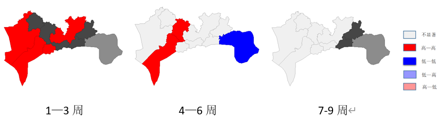

- 第1—3周的疫情传播空间分布中的热点区域为宝安区、光明区、福田区、龙岗区，这表明疫情早期传播是从经济发展迅速、人口流动频繁的西南地区开始的，且空间分布较发散。
- 第4—6周的空间分布和整体的累计确诊人数空间分布区域相同，这是因为在前期疫情爆发后，深圳市采取了管控措施，降低疫情在各区间的大面积传播概率，这一举措初见成效。
- 第7—9周时，疫情基本得到控制，空间分布不显著，仅有一些偶发的零星病例呈现随机分布状态。
- 总之，深圳市各区的新型冠状病毒的时空分布经历了由零星发散到大范围聚集再到零星发散的过程。

 
 
 
 

# 4.2空间自回归模型

##
 
 

**4.2.1模型理论**

&emsp;&emsp;与传统回归模型相比，空间计量模型使用的数据比较丰富，包含的变量之间有更多的变化，且具有少共线性的特征。模型的结果具有更大的自由度，从而提高了估计的效率,空间面板模型还考虑了空间单元之间的互动即自相关性，它假定因变量取决于相邻的空间单元变量的值。空间面板模型表示为:
$$y_{it}=\rho\sum_{j=1}^nW_{ij}y_{it}+\beta X_{it}+\mu_{it}+\varepsilon_{it} $$

- 其中$i$是数据的空间维度,$t$是数据的时间维度,$y_{it}$是在空间单元i和时间t上的因变量,$X_{it}$是在空间单元i与时间t上的自变量,$\mu_{it}$是空间的个体效应，表示不受时间影响的空间自身特质,$\beta$是空间回归系数，它主要反映了空间独立自变量与因变量之间的关系
- $W_{ij}$是空间权重矩阵，本研究中采用空间邻接矩阵表示区域数据集之间的空间相邻关系，若区域i与区域j是直接相邻的关系，$W_{ij}=1$,否则$W_{ij}=0$,$\rho$是空间自回归系数，其反映了空间领域间的影响,$\varepsilon_{it}$是与空间和时间都有关系的随机误差项，其服从均值为0,方差为$\sigma^2$的正态分布且独立同分布。

##
 
 

**4.2.2变量选取与数据来源**

&emsp;&emsp;为深入研究上述社会经济因素对疫情空间分布的影响，这部分研究选取各区累计确诊人数（Yi）作为模型因变量，相邻行政区确诊人数(Yj)、本地生产总值（GDP）、人口密度（pd）、区位功能综合得分（POI）作为自变量。其中，

&emsp;（1）因变量（Yi）为2月3日各行政区累计确诊人数，选取这一时点的原因是此时各行政区的疫情发展已呈现出明显趋势，空间自相关性显著，可用于建立空间计量模型对其分析；此外，疫情并未处于峰值，还有一定的发展空间，便于进一步分析空间溢出效应。

&emsp;（2）相邻行政区确诊人数(Yj)是模型的空间滞后项（spatial lag），这一变量使模型增加了空间效应，用以分析相邻地区确诊人数的相互影响，解释疫情在空间上所呈现出的蔓延趋势。

&emsp;（3）GDP是各行政区2019年的生产总值(单位为百亿元)，它是经济繁荣程度的代理变量，将GDP引入模型，可研究疫情空间分布与经济发展的相互关系。

&emsp;（4）pd是人口密度，采用各行政区每平方公里的年末常住人口数表示，为更好地反映人口密度变化对确诊人数的影响，此变量采用“百人/平方公里”为单位进行衡量。

---

&emsp;（5）区位功能综合得分（POI）是潜在传播风险的代理变量，POI功能越混杂且位置数越多的行政区，综合得分越高，潜在传播风险越大。在计算区位功能综合得分（POI）时，本文基于百度地图POI数据，先将POI功能归纳为市政、住宅、新兴企业、轻工业、重工业、消费娱乐、医疗7大类，并统计出各行政区内相应POI功能的位置个数，按照新兴企业、轻工业、重工业、消费娱乐风险高，住宅、市政风险中，医疗风险低赋予相应权重，最终加权求得各行政区人群聚集区域综合得分，得分范围[0,100],分数越高，对应的人群聚集活跃度越大，相应的感染风险也会增加。

&emsp;&emsp;各行政区GDP、人口密度数据查询自2019年《深圳市统计年鉴》，POI
数据来自于百度地图。

表4-1变量描述统计结果

|变量名称|定义|单位|平均数|标准差|最小值|最大值|
|:----------:|:----------:|:------:|:-----:|:------:|:------:|:------:|
|总产出（GDP）|生产总值|百亿元|25.622|23.418|2.39|70|
|人口密度（pd）|每平方公里年末常住人口数|百人/平方公里|59.417|54.730|4.131|192.817|
|区位功能综合得分（POI）|人群聚集区域综合得分|分|45.255|31.086|6.358|96.020|

##
 
 

**4.2.3模型检验**

&emsp;&emsp;在经典线性回归模型中加入空间效应，还需要对生产总值（GDP）、人口密度（pd）、区位功能综合得分（POI）这三个变量进行空间自相关检验。在此继续使用全局Moran'sI度量各变量的地理分布是否存在空间自相关性(表4-2)。

表4-2变量的空间自相关性检验结果

<table border="1" cellspacing="0">
|变量名称|Moran's I|P-value|
|:---:|:---:|:---:|
|GDP|0.266|0.039|
|pd|0.356|0.011|
|POI|0.351|0.020|

&emsp;&emsp;从4-2可以看出，三个变量的Moran'sI值均通过了显著性检验，表明生产总值（GDP）、人口密度（pd）、区位功能综合得分（POI）具有明显的空间依赖性，结合局部自相关LISA分布图可发现，POI变量存在一个显著异常点，为呈现“低-高”聚集情况的龙华区，其余位点均表现为空间正相关，“高-高”聚集区域主要位于西部的南山区，“低-低”聚集区域主要为东部的大鹏新区及坪山区。

##
 
 

**4.2.4模型设定**

&emsp;&emsp;通过空间正自相关性检验，上述变量正自相关性显著，在地理空间中存在明显聚，因此可将空间效应引入经典线性回归，建立空间自回归模型（SAR），具体设定如下：
$$Y_i=\rho\sum_{j=1}^nW_{ij}Y_j+\beta_1GDP_i+\beta_2pd_i+\beta_3POI_i+\beta_0+\varepsilon_i$$

&emsp;&emsp;其中，$W_{ij}$为空间权重矩阵，在此使用理论部分定义的空间邻接矩阵，$\rho$指本地确诊人数与相邻地区确诊人数空间相互作用的方向和程度，$\beta_0$是模型系数,$GDP$、$pd$、$POI$分别表示各行政区2019年的生产总值、人口密度、区位功能综合得分；$\beta_1$、$\beta_2$、$\beta_3$分别为生产总值、人口密度、区位功能综合得分的影响系数。

##

**4.2.5模型估计**

- 选择广义空间二阶最小二乘法（GS2sls）对各参数进行估计，估计结果如下：

表4-3空间自回归模型结果

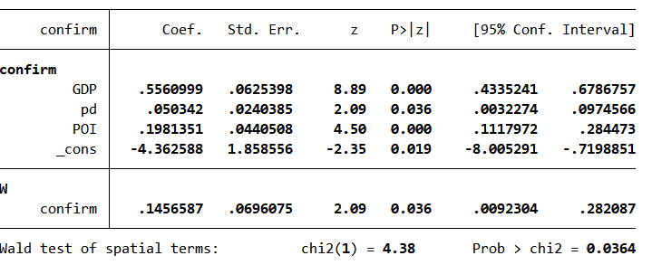

&emsp;&emsp;由图可知，空间权重即空间依赖性的系数为0.146,P值小于0.05,表示有相邻影响效应的存在且高度显著，风险因素分析表明总产出（GDP）与疫情确诊人数（confirm）存在正相关关系，且P值小于0.05高度显著，这表明该地区GDP每增加一个单位（百亿元），本地确诊人数平均增加增加0.56个单位（人）。此外，人口密度（pd）、区位功能综合得分（POI）也同确诊人数（confirm）存在正相关关系，且显著。随着人口密度以及区位功能重要性的增大，该地确诊人数也随之增加。

---

&emsp;&emsp;接下来将重点分析要素变化产生的空间溢出效应，即某一地区各因素变化，对其他地区确诊人数的影响，参考$Lesage$和$Pace$提出的偏微分法，测算因空间依赖而产生的直接效应、间接效应及总效应。表4-4显示了基于偏微分方法对溢出效应进行分解之后的结果：

表4-4空间自回归模型直接效应和溢出效应分解

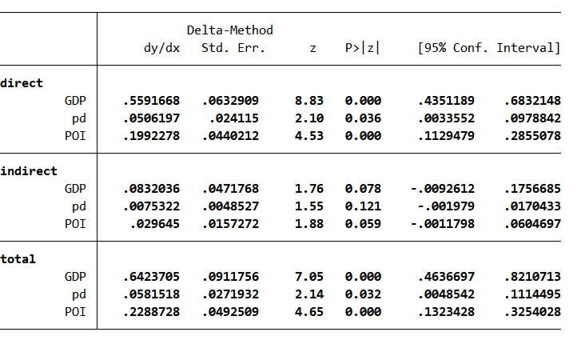

##
 
 

 **效应分析**

- 总效应=直接效应+间接效应

- 总效应可以分解为两部分：一是直接效应即本地效应，表示本区域社会经济发展程度对本地确诊人数的影响；二是间接效应，即溢出效应，表示本区域社会经济因素对相邻地区确诊人数的影响。根据表4-4的分解结果可知dy/dx是各个自变量对因变量的边际效应，接下来以人口密度pd为例进行说明：

- 直接效应下的pd系数为0.05,即本地每平方公里上增加100人,本地感染人数平均增加0.05人；

- 间接效应下的pd系数为0.007,即本地每平方公里上增加100人，相邻地区感染人数平均增加0.007人。可见，人口密度变化存在一定的空间溢出效应，因此在疫情期间严禁人口聚集及流动是控制疫情空间蔓延的强有力措施。

 
 
 
 

# 5.空间溢出效应

## 

**5.1 空间溢出效应概念**

 
 

- 以人口密度这个自变量的变化为例，当某一个地区的人口密度发生变化时，不仅

会影响本地确诊人数的变化，也会影响与本地相邻地区的确诊人数。

- 也就是说，本地人口密度的变化会波及到附近的地区，这种影响就被称之为溢出

效应。

- 更进一步，与本地相邻的地区也会延续这一效应，再次对它们的周边区域产生影

响，这种连续的影响就叫做全局溢出效应。
            

## 

**5.2 空间溢出效应实例**

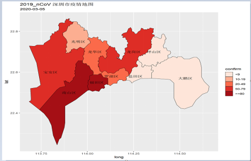

&emsp;&emsp;选定一个具体地区以它为中心，观察其空间上的溢出效应。这里我们选择的是深

圳市南山区，因为深圳市疫情的首例发病患者出现在南山区，该地累计确诊人数也是处在

十个行政区的首位。并且南山区的生产总值，人口密度，区位功能综合得分这几个变量的

空间相关性均表现出高高聚集。所以我们以它为例进行说明，可以得到一个切合实际情况

的解释结果。

## 

**以深圳市南山区的人口密度变化为例:**

&emsp;&emsp;如果南山区的人口密度由实际情况73.7(百人/平方公里)增加到100(百人/平方公里)

时,其它地区的确诊人数会如何变化?

 - 根据之前估计的模型，分下面三步解决这个问题。
 
 1. 基于原始的数据，通过估计出的模型预测各个区的确诊人数。
    
        在stata软件中使用**predict y0**实现
 
 2. 增加南山区的人口密度至100(百人/平方公里),再次预测各个行政区的确诊人数。
    
        在stata软件中使用**replace pd = 100 if cname == "南山区"**和**predict y1**实现
    
 3. 计算两次预测值的差值，将差值绘制在深圳市的地图上。
    
        在stata软件中使用**generate double y_diff = y1 - y0**、**grmap, activate**
    
        和**grmap y_diff, title("Global spillover")**实现
        
     
## 

**5.3 空间溢出效应图**

&emsp;&emsp;由南山区人口密度变化产生的确诊人数溢出效应图：

## 
**5.4 空间溢出效应的逐步分解**

&emsp;&emsp;SAR模型的矩阵形式是

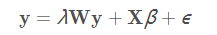

&emsp;&emsp;求解y的值

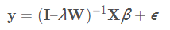

&emsp;&emsp;给定X的值下y的平均值，被称为y在X的条件下的期望。因为ϵ独立于X，y在X下的条件期望是

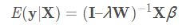

&emsp;&emsp;由于y是一个向量，这个条件期望表示深圳市每个区确诊人数的平均值。
&emsp;&emsp;下面这个公式表示当X从一组值变化到另一组值后，y的变化效果。

&emsp;&emsp;将$X_0$中南山区的人口密度增加到100个单位时，其余数据均保持不变，
$d$对应的即为$X_1$。通过这种表示，我们可计算从$X_0$到$X_1$的改变所引起的深圳市每个行政区平均确诊人数的变化。

## 
**5.5 空间溢出效应的逐步分解**

&emsp;&emsp;其中，$ΔX=X_1–X_0$。
接下来，我们以 SAR 模型为基础，构造用于产生动图的表达式。逆矩阵可以用
等比数列展开公式写成指数大小逐渐减小的各项之和：

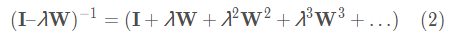

&emsp;&emsp;将公式 (2) 代入公式 (1)，得到

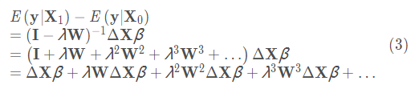

&emsp;&emsp;公式(3)就是生成动态图形效果的表达式。每一项都很直观，在案例中很容易解释：

&emsp;&emsp;第一项$ΔXβ$是初始效应变化，它只影响南山区本地的确诊人数。

&emsp;&emsp;第二项$λWΔXβ$是南山区确诊人数的变化对其邻居的影响。

&emsp;&emsp;第三项$λ^2 W^2ΔXβ$是南山区的变化对南山区邻居的邻居的影响。

&emsp;&emsp;依次类推，可以得到其他变量的含义。

## 

**为溢出效应创建动态图形**

&emsp;&emsp;上图从左到右显示了南山区人口密度（pd）由73.7增加到100(百人/平方公里)

时，对本地及周边确诊人数的连续动态溢出效应。

  第一个图仅显示第一项$ΔXβ$计算的变化。
  
  第二个图仅显示从第一项到第二项$ΔXβ+λWΔXβ$计算的变化。
  
  第三个图显示从第一项到第三项$ΔXβ+λWΔXβ+λ^2 W^2ΔXβ$计算的变化，以此类推。

&emsp;&emsp;可以看出这一效应在连续作用4期后遍布所有行政区，与“溢出中心”南山

区越邻近的行政区所受的间接影响程度越大。

## 

**5.6 空间溢出效应的解释**

&emsp;&emsp;上述研究选取的是2月3日各区累计确诊人数，此时疫情并未处于峰值，还有一定的

发展空间。将疫情首发地南山区的动态溢出效应图与疫情实际发展形式进行对比，

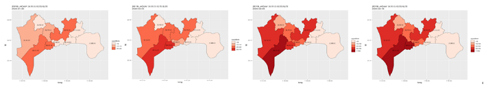

&emsp;&emsp;可看出南山区到各区的溢出效应与传染病的空间传播趋势基本吻合。

因此，对溢出效应进行逐期动态分解可以在一定程度上很好地解释疫情的空间蔓延趋势。

## 

**5.7 人口密度pd变动的政策分析**

&emsp;&emsp;假定每个行政区的人口密度都下降一个单位（百人/平方公里），使用stata软件对这一假定作分析，预测平均确诊人数的变动情况，平均确诊人数从24.78下降至24.14人。

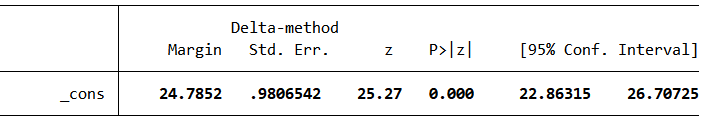

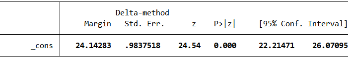

&emsp;&emsp;人口密度存在一定的空间溢出效应，是由于深圳市经济发展迅速，西部是新兴产业聚集地，汇集大量工作群体，便利的交通网络也使得人口在各区之间的流动更加频繁，因此，某一地区人口密度变化可能将本地人口集聚活动陆续渗透到周边地区，人口密度增加就相当于增加了人与人接触的机会，感染风险也相应增加,进而间接影响了周围地区的确诊人数。所以，疫情期间严格控制人口流动，减少聚集性活动是防止疫情进一步恶化的有力措施。

 
 
 
 

# 6.结论与展望

##
 
 

**6.1 深圳市疫情时空发展规律**

&emsp;&emsp;疫情变化趋势可分为以下四个阶段：

&emsp;&emsp;（1）1月1日至10日为发病初期，首发地点位于南山区多为初代感染者，疫情在

1月20日至30日达到了爆发期。疫情有以南山区、福田区为中心随时间向周围行政

区扩散的趋势.

&emsp;&emsp;（2）1月30日后，感染人数增速放缓，深圳市疫情迎来第一个拐点。2月3日起深

圳市新增确诊人数逐日减少，前期的管控措施起到了很好效果，有效阻断疫情在人

群中的蔓延。疫情空间分布总体呈现东北—西南走向，主要集聚于西部各区。

&emsp;&emsp;（3）2月1日起新增出院人数逐日增加，2月17日，新增确诊与出院人数同步变化。

&emsp;&emsp;（4）自2月26日起，新增确诊人数逐渐趋于0，深圳市疫情已得到基本控制。 

##
 
 

**6.2 深圳市疫情传染特征**

&emsp;&emsp;（1）**年龄特征**：深圳市病例30-70岁人数最多，工作群体与老年人为易感人群。

&emsp;&emsp;（2）**感染源特征**：早期发病（1月1日至10日）的初代传染者多为湖北输入型。

&emsp;&emsp;（3）**集群式感染特征**：由于与湖北有直接接触的患者起初并不知晓此疾病的

存在，导致潜伏时期该地区与其接触的亲人、所生活社区的成员发生了大规模传染。

&emsp;&emsp;（4）**深圳市疫情重症患者的主要特征**： 年龄和发病时段是其主要因素，年龄

越大的早期发病者为重症患者的可能性较大。

##
 
 

**6.3 深圳市确诊人数的空间溢出效应**

&emsp;&emsp;通过建立空间自回归模型，发现深圳市疫情分布与各区经济发展状况、人口密度、

区位功能等社会经济因素具有高度的空间相关性，且确诊人数在相邻区域内存在空间

溢出效应。对动态溢出效应逐步分解可用于对疫情空间蔓延趋势进行预测，进而识别

溢出效应较高的地区，并对其进行重点防控。

##
 
 

**6.4模型的改进与展望**

&emsp;&emsp;（1）此次报告模型使用的空间权重矩阵是空间邻接矩阵，只考虑了地理因素，如果

研究的范围较广，比如涉及省际、国际地区之间的关联关系，还需要引入经济因素，

建立地理-经济嵌套矩阵，这种联系会更接近真实世界的情况。

&emsp;&emsp;（2）建立的空间自回归模型使用的仅仅是截面数据，希望之后能加入

时间因素建立空间面板模型，探究深圳市疫情的时空演变规律。

 
 
 
 

# Thank you!